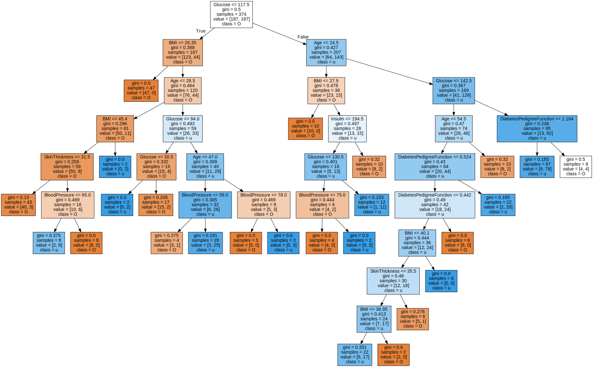

# Import Library


```python
import pandas as pd
from sklearn.tree import DecisionTreeClassifier
from sklearn.model_selection import train_test_split
from sklearn import metrics
from sklearn.metrics import accuracy_score
from sklearn.utils import shuffle

import numpy as np

import matplotlib.pyplot as plt
```

# Data Load
- 데이터 출처 : [Pima Indians Diabetes Database](https://www.kaggle.com/uciml/pima-indians-diabetes-database)

> Data Explain
- pima indian의 사람들을 대상으로 여러 정보를 취합하여 당뇨병의 유무를 진단하기 위한 데이터
- 수집 대상은 21세 이상의 여성이다.


```python
data = pd.read_csv('diabetes.csv')
```


```python
data.head()
```


  <div id="df-74328efa-37a6-4d99-b333-041fc74266c6">
    <div class="colab-df-container">
      <div>
<style scoped>
    .dataframe tbody tr th:only-of-type {
        vertical-align: middle;
    }
    
    .dataframe tbody tr th {
        vertical-align: top;
    }
    
    .dataframe thead th {
        text-align: right;
    }
</style>
<table border="1" class="dataframe">
  <thead>
    <tr style="text-align: right;">
      <th></th>
      <th>Pregnancies</th>
      <th>Glucose</th>
      <th>BloodPressure</th>
      <th>SkinThickness</th>
      <th>Insulin</th>
      <th>BMI</th>
      <th>DiabetesPedigreeFunction</th>
      <th>Age</th>
      <th>Outcome</th>
    </tr>
  </thead>
  <tbody>
    <tr>
      <th>0</th>
      <td>6</td>
      <td>148</td>
      <td>72</td>
      <td>35</td>
      <td>0</td>
      <td>33.6</td>
      <td>0.627</td>
      <td>50</td>
      <td>1</td>
    </tr>
    <tr>
      <th>1</th>
      <td>1</td>
      <td>85</td>
      <td>66</td>
      <td>29</td>
      <td>0</td>
      <td>26.6</td>
      <td>0.351</td>
      <td>31</td>
      <td>0</td>
    </tr>
    <tr>
      <th>2</th>
      <td>8</td>
      <td>183</td>
      <td>64</td>
      <td>0</td>
      <td>0</td>
      <td>23.3</td>
      <td>0.672</td>
      <td>32</td>
      <td>1</td>
    </tr>
    <tr>
      <th>3</th>
      <td>1</td>
      <td>89</td>
      <td>66</td>
      <td>23</td>
      <td>94</td>
      <td>28.1</td>
      <td>0.167</td>
      <td>21</td>
      <td>0</td>
    </tr>
    <tr>
      <th>4</th>
      <td>0</td>
      <td>137</td>
      <td>40</td>
      <td>35</td>
      <td>168</td>
      <td>43.1</td>
      <td>2.288</td>
      <td>33</td>
      <td>1</td>
    </tr>
  </tbody>
</table>
</div>
      <button class="colab-df-convert" onclick="convertToInteractive('df-74328efa-37a6-4d99-b333-041fc74266c6')"
              title="Convert this dataframe to an interactive table."
              style="display:none;">

  <svg xmlns="http://www.w3.org/2000/svg" height="24px"viewBox="0 0 24 24"
       width="24px">
    <path d="M0 0h24v24H0V0z" fill="none"/>
    <path d="M18.56 5.44l.94 2.06.94-2.06 2.06-.94-2.06-.94-.94-2.06-.94 2.06-2.06.94zm-11 1L8.5 8.5l.94-2.06 2.06-.94-2.06-.94L8.5 2.5l-.94 2.06-2.06.94zm10 10l.94 2.06.94-2.06 2.06-.94-2.06-.94-.94-2.06-.94 2.06-2.06.94z"/><path d="M17.41 7.96l-1.37-1.37c-.4-.4-.92-.59-1.43-.59-.52 0-1.04.2-1.43.59L10.3 9.45l-7.72 7.72c-.78.78-.78 2.05 0 2.83L4 21.41c.39.39.9.59 1.41.59.51 0 1.02-.2 1.41-.59l7.78-7.78 2.81-2.81c.8-.78.8-2.07 0-2.86zM5.41 20L4 18.59l7.72-7.72 1.47 1.35L5.41 20z"/>
  </svg>
      </button>

  <style>
    .colab-df-container {
      display:flex;
      flex-wrap:wrap;
      gap: 12px;
    }
    
    .colab-df-convert {
      background-color: #E8F0FE;
      border: none;
      border-radius: 50%;
      cursor: pointer;
      display: none;
      fill: #1967D2;
      height: 32px;
      padding: 0 0 0 0;
      width: 32px;
    }
    
    .colab-df-convert:hover {
      background-color: #E2EBFA;
      box-shadow: 0px 1px 2px rgba(60, 64, 67, 0.3), 0px 1px 3px 1px rgba(60, 64, 67, 0.15);
      fill: #174EA6;
    }
    
    [theme=dark] .colab-df-convert {
      background-color: #3B4455;
      fill: #D2E3FC;
    }
    
    [theme=dark] .colab-df-convert:hover {
      background-color: #434B5C;
      box-shadow: 0px 1px 3px 1px rgba(0, 0, 0, 0.15);
      filter: drop-shadow(0px 1px 2px rgba(0, 0, 0, 0.3));
      fill: #FFFFFF;
    }
  </style>

      <script>
        const buttonEl =
          document.querySelector('#df-74328efa-37a6-4d99-b333-041fc74266c6 button.colab-df-convert');
        buttonEl.style.display =
          google.colab.kernel.accessAllowed ? 'block' : 'none';
    
        async function convertToInteractive(key) {
          const element = document.querySelector('#df-74328efa-37a6-4d99-b333-041fc74266c6');
          const dataTable =
            await google.colab.kernel.invokeFunction('convertToInteractive',
                                                     [key], {});
          if (!dataTable) return;
    
          const docLinkHtml = 'Like what you see? Visit the ' +
            '<a target="_blank" href=https://colab.research.google.com/notebooks/data_table.ipynb>data table notebook</a>'
            + ' to learn more about interactive tables.';
          element.innerHTML = '';
          dataTable['output_type'] = 'display_data';
          await google.colab.output.renderOutput(dataTable, element);
          const docLink = document.createElement('div');
          docLink.innerHTML = docLinkHtml;
          element.appendChild(docLink);
        }
      </script>
    </div>
  </div>


> Data Feature Information
- Pregnancies : 임신 횟수
- Glucose : 혈당 (보통 공복 후 측정한 혈당이 126 mg/dL 이상인 경우 당뇨병으로 진단), 즉 굉장히 중요한 feature
- Blood Pressure : 혈압
- Skin Thickness : 피부 두께
- Insulin : 인슐린 분비량
- BMI : 체질량 지수
- Diabetes Pedigree Function : 당뇨 혈통 기능? (당뇨의 유전을 이야기 하는 듯?)
- Age : 나이


```python
col_names = list(data.columns)

feature = col_names[:-1]
label = col_names[-1]
```


```python
print("당뇨 여부 class : ", col_names[-1])
```

    당뇨 여부 class :  Outcome
​    

# Data Exploration

### Find Null


```python
data.shape
```


    (768, 9)


```python
pd.isnull(data).sum()
```


    Pregnancies                 0
    Glucose                     0
    BloodPressure               0
    SkinThickness               0
    Insulin                     0
    BMI                         0
    DiabetesPedigreeFunction    0
    Age                         0
    Outcome                     0
    dtype: int64


### Data Type


```python
data.dtypes
```


    Pregnancies                   int64
    Glucose                       int64
    BloodPressure                 int64
    SkinThickness                 int64
    Insulin                       int64
    BMI                         float64
    DiabetesPedigreeFunction    float64
    Age                           int64
    Outcome                       int64
    dtype: object


> class를 나타내는 Outcome을 제외하면 모두 연속형 변수이다.

### Class Ratio


```python
group = data.groupby('Outcome')
```


```python
print("당뇨병   : ", group.count()['Age'][1])
print("당뇨병 X : ", group.count()['Age'][0])
```

    당뇨병   :  268
    당뇨병 X :  500


> 수집된 데이터에서 당뇨병 환자가 환자가 아닌 경우에 비해 절반이다. 데이터가 불균형하기 때문에 훈련 할 때에는 균형을 맞출 필요가 있다.

### 당뇨병 vs 정상


```python
group.apply(lambda x : x.describe())[feature]
```


  <div id="df-08702486-9d49-4fbc-b72c-7089bafb66af">
    <div class="colab-df-container">
      <div>
<style scoped>
    .dataframe tbody tr th:only-of-type {
        vertical-align: middle;
    }
    
    .dataframe tbody tr th {
        vertical-align: top;
    }
    
    .dataframe thead th {
        text-align: right;
    }
</style>
<table border="1" class="dataframe">
  <thead>
    <tr style="text-align: right;">
      <th></th>
      <th></th>
      <th>Pregnancies</th>
      <th>Glucose</th>
      <th>BloodPressure</th>
      <th>SkinThickness</th>
      <th>Insulin</th>
      <th>BMI</th>
      <th>DiabetesPedigreeFunction</th>
      <th>Age</th>
    </tr>
    <tr>
      <th>Outcome</th>
      <th></th>
      <th></th>
      <th></th>
      <th></th>
      <th></th>
      <th></th>
      <th></th>
      <th></th>
      <th></th>
    </tr>
  </thead>
  <tbody>
    <tr>
      <th rowspan="8" valign="top">0</th>
      <th>count</th>
      <td>500.000000</td>
      <td>500.000000</td>
      <td>500.000000</td>
      <td>500.000000</td>
      <td>500.000000</td>
      <td>500.000000</td>
      <td>500.000000</td>
      <td>500.000000</td>
    </tr>
    <tr>
      <th>mean</th>
      <td>3.298000</td>
      <td>109.980000</td>
      <td>68.184000</td>
      <td>19.664000</td>
      <td>68.792000</td>
      <td>30.304200</td>
      <td>0.429734</td>
      <td>31.190000</td>
    </tr>
    <tr>
      <th>std</th>
      <td>3.017185</td>
      <td>26.141200</td>
      <td>18.063075</td>
      <td>14.889947</td>
      <td>98.865289</td>
      <td>7.689855</td>
      <td>0.299085</td>
      <td>11.667655</td>
    </tr>
    <tr>
      <th>min</th>
      <td>0.000000</td>
      <td>0.000000</td>
      <td>0.000000</td>
      <td>0.000000</td>
      <td>0.000000</td>
      <td>0.000000</td>
      <td>0.078000</td>
      <td>21.000000</td>
    </tr>
    <tr>
      <th>25%</th>
      <td>1.000000</td>
      <td>93.000000</td>
      <td>62.000000</td>
      <td>0.000000</td>
      <td>0.000000</td>
      <td>25.400000</td>
      <td>0.229750</td>
      <td>23.000000</td>
    </tr>
    <tr>
      <th>50%</th>
      <td>2.000000</td>
      <td>107.000000</td>
      <td>70.000000</td>
      <td>21.000000</td>
      <td>39.000000</td>
      <td>30.050000</td>
      <td>0.336000</td>
      <td>27.000000</td>
    </tr>
    <tr>
      <th>75%</th>
      <td>5.000000</td>
      <td>125.000000</td>
      <td>78.000000</td>
      <td>31.000000</td>
      <td>105.000000</td>
      <td>35.300000</td>
      <td>0.561750</td>
      <td>37.000000</td>
    </tr>
    <tr>
      <th>max</th>
      <td>13.000000</td>
      <td>197.000000</td>
      <td>122.000000</td>
      <td>60.000000</td>
      <td>744.000000</td>
      <td>57.300000</td>
      <td>2.329000</td>
      <td>81.000000</td>
    </tr>
    <tr>
      <th rowspan="8" valign="top">1</th>
      <th>count</th>
      <td>268.000000</td>
      <td>268.000000</td>
      <td>268.000000</td>
      <td>268.000000</td>
      <td>268.000000</td>
      <td>268.000000</td>
      <td>268.000000</td>
      <td>268.000000</td>
    </tr>
    <tr>
      <th>mean</th>
      <td>4.865672</td>
      <td>141.257463</td>
      <td>70.824627</td>
      <td>22.164179</td>
      <td>100.335821</td>
      <td>35.142537</td>
      <td>0.550500</td>
      <td>37.067164</td>
    </tr>
    <tr>
      <th>std</th>
      <td>3.741239</td>
      <td>31.939622</td>
      <td>21.491812</td>
      <td>17.679711</td>
      <td>138.689125</td>
      <td>7.262967</td>
      <td>0.372354</td>
      <td>10.968254</td>
    </tr>
    <tr>
      <th>min</th>
      <td>0.000000</td>
      <td>0.000000</td>
      <td>0.000000</td>
      <td>0.000000</td>
      <td>0.000000</td>
      <td>0.000000</td>
      <td>0.088000</td>
      <td>21.000000</td>
    </tr>
    <tr>
      <th>25%</th>
      <td>1.750000</td>
      <td>119.000000</td>
      <td>66.000000</td>
      <td>0.000000</td>
      <td>0.000000</td>
      <td>30.800000</td>
      <td>0.262500</td>
      <td>28.000000</td>
    </tr>
    <tr>
      <th>50%</th>
      <td>4.000000</td>
      <td>140.000000</td>
      <td>74.000000</td>
      <td>27.000000</td>
      <td>0.000000</td>
      <td>34.250000</td>
      <td>0.449000</td>
      <td>36.000000</td>
    </tr>
    <tr>
      <th>75%</th>
      <td>8.000000</td>
      <td>167.000000</td>
      <td>82.000000</td>
      <td>36.000000</td>
      <td>167.250000</td>
      <td>38.775000</td>
      <td>0.728000</td>
      <td>44.000000</td>
    </tr>
    <tr>
      <th>max</th>
      <td>17.000000</td>
      <td>199.000000</td>
      <td>114.000000</td>
      <td>99.000000</td>
      <td>846.000000</td>
      <td>67.100000</td>
      <td>2.420000</td>
      <td>70.000000</td>
    </tr>
  </tbody>
</table>
</div>
      <button class="colab-df-convert" onclick="convertToInteractive('df-08702486-9d49-4fbc-b72c-7089bafb66af')"
              title="Convert this dataframe to an interactive table."
              style="display:none;">

  <svg xmlns="http://www.w3.org/2000/svg" height="24px"viewBox="0 0 24 24"
       width="24px">
    <path d="M0 0h24v24H0V0z" fill="none"/>
    <path d="M18.56 5.44l.94 2.06.94-2.06 2.06-.94-2.06-.94-.94-2.06-.94 2.06-2.06.94zm-11 1L8.5 8.5l.94-2.06 2.06-.94-2.06-.94L8.5 2.5l-.94 2.06-2.06.94zm10 10l.94 2.06.94-2.06 2.06-.94-2.06-.94-.94-2.06-.94 2.06-2.06.94z"/><path d="M17.41 7.96l-1.37-1.37c-.4-.4-.92-.59-1.43-.59-.52 0-1.04.2-1.43.59L10.3 9.45l-7.72 7.72c-.78.78-.78 2.05 0 2.83L4 21.41c.39.39.9.59 1.41.59.51 0 1.02-.2 1.41-.59l7.78-7.78 2.81-2.81c.8-.78.8-2.07 0-2.86zM5.41 20L4 18.59l7.72-7.72 1.47 1.35L5.41 20z"/>
  </svg>
      </button>

  <style>
    .colab-df-container {
      display:flex;
      flex-wrap:wrap;
      gap: 12px;
    }
    
    .colab-df-convert {
      background-color: #E8F0FE;
      border: none;
      border-radius: 50%;
      cursor: pointer;
      display: none;
      fill: #1967D2;
      height: 32px;
      padding: 0 0 0 0;
      width: 32px;
    }
    
    .colab-df-convert:hover {
      background-color: #E2EBFA;
      box-shadow: 0px 1px 2px rgba(60, 64, 67, 0.3), 0px 1px 3px 1px rgba(60, 64, 67, 0.15);
      fill: #174EA6;
    }
    
    [theme=dark] .colab-df-convert {
      background-color: #3B4455;
      fill: #D2E3FC;
    }
    
    [theme=dark] .colab-df-convert:hover {
      background-color: #434B5C;
      box-shadow: 0px 1px 3px 1px rgba(0, 0, 0, 0.15);
      filter: drop-shadow(0px 1px 2px rgba(0, 0, 0, 0.3));
      fill: #FFFFFF;
    }
  </style>

      <script>
        const buttonEl =
          document.querySelector('#df-08702486-9d49-4fbc-b72c-7089bafb66af button.colab-df-convert');
        buttonEl.style.display =
          google.colab.kernel.accessAllowed ? 'block' : 'none';
    
        async function convertToInteractive(key) {
          const element = document.querySelector('#df-08702486-9d49-4fbc-b72c-7089bafb66af');
          const dataTable =
            await google.colab.kernel.invokeFunction('convertToInteractive',
                                                     [key], {});
          if (!dataTable) return;
    
          const docLinkHtml = 'Like what you see? Visit the ' +
            '<a target="_blank" href=https://colab.research.google.com/notebooks/data_table.ipynb>data table notebook</a>'
            + ' to learn more about interactive tables.';
          element.innerHTML = '';
          dataTable['output_type'] = 'display_data';
          await google.colab.output.renderOutput(dataTable, element);
          const docLink = document.createElement('div');
          docLink.innerHTML = docLinkHtml;
          element.appendChild(docLink);
        }
      </script>
    </div>
  </div>


```python
group.mean()
```


  <div id="df-ae0a0173-665a-4e15-a363-869646c3ce9a">
    <div class="colab-df-container">
      <div>
<style scoped>
    .dataframe tbody tr th:only-of-type {
        vertical-align: middle;
    }
    
    .dataframe tbody tr th {
        vertical-align: top;
    }
    
    .dataframe thead th {
        text-align: right;
    }
</style>
<table border="1" class="dataframe">
  <thead>
    <tr style="text-align: right;">
      <th></th>
      <th>Pregnancies</th>
      <th>Glucose</th>
      <th>BloodPressure</th>
      <th>SkinThickness</th>
      <th>Insulin</th>
      <th>BMI</th>
      <th>DiabetesPedigreeFunction</th>
      <th>Age</th>
    </tr>
    <tr>
      <th>Outcome</th>
      <th></th>
      <th></th>
      <th></th>
      <th></th>
      <th></th>
      <th></th>
      <th></th>
      <th></th>
    </tr>
  </thead>
  <tbody>
    <tr>
      <th>0</th>
      <td>3.298000</td>
      <td>109.980000</td>
      <td>68.184000</td>
      <td>19.664000</td>
      <td>68.792000</td>
      <td>30.304200</td>
      <td>0.429734</td>
      <td>31.190000</td>
    </tr>
    <tr>
      <th>1</th>
      <td>4.865672</td>
      <td>141.257463</td>
      <td>70.824627</td>
      <td>22.164179</td>
      <td>100.335821</td>
      <td>35.142537</td>
      <td>0.550500</td>
      <td>37.067164</td>
    </tr>
  </tbody>
</table>
</div>
      <button class="colab-df-convert" onclick="convertToInteractive('df-ae0a0173-665a-4e15-a363-869646c3ce9a')"
              title="Convert this dataframe to an interactive table."
              style="display:none;">

  <svg xmlns="http://www.w3.org/2000/svg" height="24px"viewBox="0 0 24 24"
       width="24px">
    <path d="M0 0h24v24H0V0z" fill="none"/>
    <path d="M18.56 5.44l.94 2.06.94-2.06 2.06-.94-2.06-.94-.94-2.06-.94 2.06-2.06.94zm-11 1L8.5 8.5l.94-2.06 2.06-.94-2.06-.94L8.5 2.5l-.94 2.06-2.06.94zm10 10l.94 2.06.94-2.06 2.06-.94-2.06-.94-.94-2.06-.94 2.06-2.06.94z"/><path d="M17.41 7.96l-1.37-1.37c-.4-.4-.92-.59-1.43-.59-.52 0-1.04.2-1.43.59L10.3 9.45l-7.72 7.72c-.78.78-.78 2.05 0 2.83L4 21.41c.39.39.9.59 1.41.59.51 0 1.02-.2 1.41-.59l7.78-7.78 2.81-2.81c.8-.78.8-2.07 0-2.86zM5.41 20L4 18.59l7.72-7.72 1.47 1.35L5.41 20z"/>
  </svg>
      </button>

  <style>
    .colab-df-container {
      display:flex;
      flex-wrap:wrap;
      gap: 12px;
    }
    
    .colab-df-convert {
      background-color: #E8F0FE;
      border: none;
      border-radius: 50%;
      cursor: pointer;
      display: none;
      fill: #1967D2;
      height: 32px;
      padding: 0 0 0 0;
      width: 32px;
    }
    
    .colab-df-convert:hover {
      background-color: #E2EBFA;
      box-shadow: 0px 1px 2px rgba(60, 64, 67, 0.3), 0px 1px 3px 1px rgba(60, 64, 67, 0.15);
      fill: #174EA6;
    }
    
    [theme=dark] .colab-df-convert {
      background-color: #3B4455;
      fill: #D2E3FC;
    }
    
    [theme=dark] .colab-df-convert:hover {
      background-color: #434B5C;
      box-shadow: 0px 1px 3px 1px rgba(0, 0, 0, 0.15);
      filter: drop-shadow(0px 1px 2px rgba(0, 0, 0, 0.3));
      fill: #FFFFFF;
    }
  </style>

      <script>
        const buttonEl =
          document.querySelector('#df-ae0a0173-665a-4e15-a363-869646c3ce9a button.colab-df-convert');
        buttonEl.style.display =
          google.colab.kernel.accessAllowed ? 'block' : 'none';
    
        async function convertToInteractive(key) {
          const element = document.querySelector('#df-ae0a0173-665a-4e15-a363-869646c3ce9a');
          const dataTable =
            await google.colab.kernel.invokeFunction('convertToInteractive',
                                                     [key], {});
          if (!dataTable) return;
    
          const docLinkHtml = 'Like what you see? Visit the ' +
            '<a target="_blank" href=https://colab.research.google.com/notebooks/data_table.ipynb>data table notebook</a>'
            + ' to learn more about interactive tables.';
          element.innerHTML = '';
          dataTable['output_type'] = 'display_data';
          await google.colab.output.renderOutput(dataTable, element);
          const docLink = document.createElement('div');
          docLink.innerHTML = docLinkHtml;
          element.appendChild(docLink);
        }
      </script>
    </div>
  </div>


> 당뇨병이 있는 사람은 기본적으로 모두 다 높게 나오는 편이다. 특히 혈당과 인슐린 수치, BMI에서 큰 차이를 보인다.

# Data Preprocessing


```python
x_train, x_test, y_train, y_test = train_test_split(data[feature], data[label], test_size=0.3, random_state=1)
```


```python
x_train.head(3)
```


  <div id="df-493b3358-38fb-41fa-9c18-3e735fc09528">
    <div class="colab-df-container">
      <div>
<style scoped>
    .dataframe tbody tr th:only-of-type {
        vertical-align: middle;
    }
    
    .dataframe tbody tr th {
        vertical-align: top;
    }
    
    .dataframe thead th {
        text-align: right;
    }
</style>
<table border="1" class="dataframe">
  <thead>
    <tr style="text-align: right;">
      <th></th>
      <th>Pregnancies</th>
      <th>Glucose</th>
      <th>BloodPressure</th>
      <th>SkinThickness</th>
      <th>Insulin</th>
      <th>BMI</th>
      <th>DiabetesPedigreeFunction</th>
      <th>Age</th>
    </tr>
  </thead>
  <tbody>
    <tr>
      <th>88</th>
      <td>15</td>
      <td>136</td>
      <td>70</td>
      <td>32</td>
      <td>110</td>
      <td>37.1</td>
      <td>0.153</td>
      <td>43</td>
    </tr>
    <tr>
      <th>467</th>
      <td>0</td>
      <td>97</td>
      <td>64</td>
      <td>36</td>
      <td>100</td>
      <td>36.8</td>
      <td>0.600</td>
      <td>25</td>
    </tr>
    <tr>
      <th>550</th>
      <td>1</td>
      <td>116</td>
      <td>70</td>
      <td>28</td>
      <td>0</td>
      <td>27.4</td>
      <td>0.204</td>
      <td>21</td>
    </tr>
  </tbody>
</table>
</div>
      <button class="colab-df-convert" onclick="convertToInteractive('df-493b3358-38fb-41fa-9c18-3e735fc09528')"
              title="Convert this dataframe to an interactive table."
              style="display:none;">

  <svg xmlns="http://www.w3.org/2000/svg" height="24px"viewBox="0 0 24 24"
       width="24px">
    <path d="M0 0h24v24H0V0z" fill="none"/>
    <path d="M18.56 5.44l.94 2.06.94-2.06 2.06-.94-2.06-.94-.94-2.06-.94 2.06-2.06.94zm-11 1L8.5 8.5l.94-2.06 2.06-.94-2.06-.94L8.5 2.5l-.94 2.06-2.06.94zm10 10l.94 2.06.94-2.06 2.06-.94-2.06-.94-.94-2.06-.94 2.06-2.06.94z"/><path d="M17.41 7.96l-1.37-1.37c-.4-.4-.92-.59-1.43-.59-.52 0-1.04.2-1.43.59L10.3 9.45l-7.72 7.72c-.78.78-.78 2.05 0 2.83L4 21.41c.39.39.9.59 1.41.59.51 0 1.02-.2 1.41-.59l7.78-7.78 2.81-2.81c.8-.78.8-2.07 0-2.86zM5.41 20L4 18.59l7.72-7.72 1.47 1.35L5.41 20z"/>
  </svg>
      </button>

  <style>
    .colab-df-container {
      display:flex;
      flex-wrap:wrap;
      gap: 12px;
    }
    
    .colab-df-convert {
      background-color: #E8F0FE;
      border: none;
      border-radius: 50%;
      cursor: pointer;
      display: none;
      fill: #1967D2;
      height: 32px;
      padding: 0 0 0 0;
      width: 32px;
    }
    
    .colab-df-convert:hover {
      background-color: #E2EBFA;
      box-shadow: 0px 1px 2px rgba(60, 64, 67, 0.3), 0px 1px 3px 1px rgba(60, 64, 67, 0.15);
      fill: #174EA6;
    }
    
    [theme=dark] .colab-df-convert {
      background-color: #3B4455;
      fill: #D2E3FC;
    }
    
    [theme=dark] .colab-df-convert:hover {
      background-color: #434B5C;
      box-shadow: 0px 1px 3px 1px rgba(0, 0, 0, 0.15);
      filter: drop-shadow(0px 1px 2px rgba(0, 0, 0, 0.3));
      fill: #FFFFFF;
    }
  </style>

      <script>
        const buttonEl =
          document.querySelector('#df-493b3358-38fb-41fa-9c18-3e735fc09528 button.colab-df-convert');
        buttonEl.style.display =
          google.colab.kernel.accessAllowed ? 'block' : 'none';
    
        async function convertToInteractive(key) {
          const element = document.querySelector('#df-493b3358-38fb-41fa-9c18-3e735fc09528');
          const dataTable =
            await google.colab.kernel.invokeFunction('convertToInteractive',
                                                     [key], {});
          if (!dataTable) return;
    
          const docLinkHtml = 'Like what you see? Visit the ' +
            '<a target="_blank" href=https://colab.research.google.com/notebooks/data_table.ipynb>data table notebook</a>'
            + ' to learn more about interactive tables.';
          element.innerHTML = '';
          dataTable['output_type'] = 'display_data';
          await google.colab.output.renderOutput(dataTable, element);
          const docLink = document.createElement('div');
          docLink.innerHTML = docLinkHtml;
          element.appendChild(docLink);
        }
      </script>
    </div>
  </div>


```python
y_train.head(3)
```


    88     1
    467    0
    550    0
    Name: Outcome, dtype: int64


```python
# 분리된 데이터에서의 클래스 분포
print("당뇨병   : ", sum(y_test))
print("당뇨병 X : ", len(y_test) - sum(y_test))
```

    당뇨병   :  85
    당뇨병 X :  146


> train_test_split 함수는 클래스의 비율을 균등하게 유지하지 못한다. 우리는 이것을 인지하고 데이터를 다시 구성하려고 한다.


```python
x_train, x_test, y_train, y_test = train_test_split(data[feature], data[label], test_size=0.3, random_state=1, stratify=data[label])
```


```python
268 * 0.7
```


    187.6


```python
data_shuffled = shuffle(data)
```


```python
eq_train_x_0 = data_shuffled[data_shuffled['Outcome'] == 0][feature][:187]
eq_train_x_1 = data_shuffled[data_shuffled['Outcome'] == 1][feature][:187]

eq_train_x = pd.concat([eq_train_x_0, eq_train_x_1])
eq_train_y = np.concatenate(([0] * len(eq_train_x_0), [1] * len(eq_train_x_1)), axis=0)

eq_test_x_0 = data_shuffled[data_shuffled['Outcome'] == 0][feature][187:]
eq_test_x_1 = data_shuffled[data_shuffled['Outcome'] == 1][feature][187:]

eq_test_x = pd.concat([eq_test_x_0, eq_test_x_1])
eq_test_y = np.concatenate(([0] * len(eq_test_x_0), [1] * len(eq_test_x_1)), axis=0)
```


```python
print(eq_train_x.shape, len(eq_train_y))
print(eq_test_x.shape, len(eq_test_y))
```

    (374, 8) 374
    (394, 8) 394


# Modeling

### Model 1


```python
clf = DecisionTreeClassifier()
clf.fit(x_train, y_train)

y_pred = clf.predict(x_test)
```

### Model 2


```python
clf2 = DecisionTreeClassifier()
clf2.fit(eq_train_x, eq_train_y)

y_pred2 = clf2.predict(eq_test_x)
```

# Model Evaluation


```python
print('accuracy : ', accuracy_score(y_test, y_pred))
```

    accuracy :  0.6926406926406926
​    


```python
print('accuracy : ', accuracy_score(eq_test_y, y_pred2))
```

    accuracy :  0.6954314720812182
​    

> ~~엥? 더 떨어졌네?? ㅋㅋㅋ~~ (학습 데이터의 클래스를 잘못 할당함... ㅋㅋ)  
> 그래도 비슷한 성능을 보인다..

# Model Visualization


```python
from sklearn import tree
import graphviz
```


```python
dot_data = tree.export_graphviz(clf, out_file = None,
                                feature_names = feature,  
                                class_names = label,
                                filled = True)
```


```python
graph = graphviz.Source(dot_data, format="png") 
graph
```


```python
!pip install dtreeviz
```

    Collecting dtreeviz
      Downloading dtreeviz-1.3.2.tar.gz (62 kB)
         |████████████████████████████████| 62 kB 696 kB/s 
    [?25hRequirement already satisfied: graphviz>=0.9 in /usr/local/lib/python3.7/dist-packages (from dtreeviz) (0.10.1)
    Requirement already satisfied: pandas in /usr/local/lib/python3.7/dist-packages (from dtreeviz) (1.1.5)
    Requirement already satisfied: numpy in /usr/local/lib/python3.7/dist-packages (from dtreeviz) (1.19.5)
    Requirement already satisfied: scikit-learn in /usr/local/lib/python3.7/dist-packages (from dtreeviz) (1.0.1)
    Requirement already satisfied: matplotlib in /usr/local/lib/python3.7/dist-packages (from dtreeviz) (3.2.2)
    Collecting colour
      Downloading colour-0.1.5-py2.py3-none-any.whl (23 kB)
    Requirement already satisfied: pytest in /usr/local/lib/python3.7/dist-packages (from dtreeviz) (3.6.4)
    Requirement already satisfied: pyparsing!=2.0.4,!=2.1.2,!=2.1.6,>=2.0.1 in /usr/local/lib/python3.7/dist-packages (from matplotlib->dtreeviz) (3.0.6)
    Requirement already satisfied: cycler>=0.10 in /usr/local/lib/python3.7/dist-packages (from matplotlib->dtreeviz) (0.11.0)
    Requirement already satisfied: python-dateutil>=2.1 in /usr/local/lib/python3.7/dist-packages (from matplotlib->dtreeviz) (2.8.2)
    Requirement already satisfied: kiwisolver>=1.0.1 in /usr/local/lib/python3.7/dist-packages (from matplotlib->dtreeviz) (1.3.2)
    Requirement already satisfied: six>=1.5 in /usr/local/lib/python3.7/dist-packages (from python-dateutil>=2.1->matplotlib->dtreeviz) (1.15.0)
    Requirement already satisfied: pytz>=2017.2 in /usr/local/lib/python3.7/dist-packages (from pandas->dtreeviz) (2018.9)
    Requirement already satisfied: atomicwrites>=1.0 in /usr/local/lib/python3.7/dist-packages (from pytest->dtreeviz) (1.4.0)
    Requirement already satisfied: pluggy<0.8,>=0.5 in /usr/local/lib/python3.7/dist-packages (from pytest->dtreeviz) (0.7.1)
    Requirement already satisfied: setuptools in /usr/local/lib/python3.7/dist-packages (from pytest->dtreeviz) (57.4.0)
    Requirement already satisfied: py>=1.5.0 in /usr/local/lib/python3.7/dist-packages (from pytest->dtreeviz) (1.11.0)
    Requirement already satisfied: more-itertools>=4.0.0 in /usr/local/lib/python3.7/dist-packages (from pytest->dtreeviz) (8.12.0)
    Requirement already satisfied: attrs>=17.4.0 in /usr/local/lib/python3.7/dist-packages (from pytest->dtreeviz) (21.2.0)
    Requirement already satisfied: joblib>=0.11 in /usr/local/lib/python3.7/dist-packages (from scikit-learn->dtreeviz) (1.1.0)
    Requirement already satisfied: scipy>=1.1.0 in /usr/local/lib/python3.7/dist-packages (from scikit-learn->dtreeviz) (1.4.1)
    Requirement already satisfied: threadpoolctl>=2.0.0 in /usr/local/lib/python3.7/dist-packages (from scikit-learn->dtreeviz) (3.0.0)
    Building wheels for collected packages: dtreeviz
      Building wheel for dtreeviz (setup.py) ... [?25l[?25hdone
      Created wheel for dtreeviz: filename=dtreeviz-1.3.2-py3-none-any.whl size=67936 sha256=c10df72ec824ee26f9e725a93682f4f26c8a25a77f39f77aeaf6c06590058b8d
      Stored in directory: /root/.cache/pip/wheels/9d/29/a1/f2ad20de79875e749330d5c6234fc5f517991fcaa23d7a3d0f
    Successfully built dtreeviz
    Installing collected packages: colour, dtreeviz
    Successfully installed colour-0.1.5 dtreeviz-1.3.2


```python
from dtreeviz.trees import dtreeviz

viz = dtreeviz(clf, x_train, y_train,
                target_name = "target",
                feature_names = feature,
                class_names = label)

viz
```

    findfont: Font family ['Arial'] not found. Falling back to DejaVu Sans.
    /usr/local/lib/python3.7/dist-packages/sklearn/base.py:446: UserWarning: X does not have valid feature names, but DecisionTreeClassifier was fitted with feature names
      "X does not have valid feature names, but"
    /usr/local/lib/python3.7/dist-packages/numpy/core/_asarray.py:83: VisibleDeprecationWarning: Creating an ndarray from ragged nested sequences (which is a list-or-tuple of lists-or-tuples-or ndarrays with different lengths or shapes) is deprecated. If you meant to do this, you must specify 'dtype=object' when creating the ndarray
      return array(a, dtype, copy=False, order=order)
    findfont: Font family ['Arial'] not found. Falling back to DejaVu Sans.
    findfont: Font family ['Arial'] not found. Falling back to DejaVu Sans.
    findfont: Font family ['Arial'] not found. Falling back to DejaVu Sans.


# Decision Tree 가지치기

### Post Pruning


```python
path = clf2.cost_complexity_pruning_path(eq_train_x, eq_train_y)
ccp_alphas, impurities = path.ccp_alphas, path.impurities
print(ccp_alphas)
```

    [0.         0.00200104 0.00237671 0.00237671 0.00245098 0.00247574
     0.00250668 0.00259952 0.00320856 0.00330579 0.00356506 0.00380273
     0.00380273 0.0039287  0.0040107  0.00413223 0.00442096 0.00442356
     0.00445633 0.00445633 0.00445633 0.00452227 0.00486223 0.00534759
     0.00585399 0.00590463 0.00616089 0.00713012 0.00727867 0.00745021
     0.00773491 0.00828877 0.0084237  0.00937527 0.01051288 0.01099147
     0.01130835 0.01297752 0.0182325  0.0218201  0.0230369  0.02428085
     0.09026874]


```python
# For each alpha we will append our model to a list
clfs = []
for ccp_alpha in ccp_alphas:
    clf = tree.DecisionTreeClassifier(random_state=0, ccp_alpha=ccp_alpha)
    clf.fit(eq_train_x, eq_train_y)
    clfs.append(clf)
```


```python
clfs = clfs[:-1]
ccp_alphas = ccp_alphas[:-1]
node_counts = [clf.tree_.node_count for clf in clfs]
depth = [clf.tree_.max_depth for clf in clfs]
plt.scatter(ccp_alphas,node_counts)
plt.scatter(ccp_alphas,depth)
plt.plot(ccp_alphas,node_counts,label='no of nodes',drawstyle="steps-post")
plt.plot(ccp_alphas,depth,label='depth',drawstyle="steps-post")
plt.legend()
plt.show()
```


```python
train_acc = []
test_acc = []
for c in clfs:
    y_train_pred = c.predict(eq_train_x)
    y_test_pred = c.predict(eq_test_x)
    train_acc.append(accuracy_score(y_train_pred,eq_train_y))
    test_acc.append(accuracy_score(y_test_pred,eq_test_y))

plt.scatter(ccp_alphas,train_acc)
plt.scatter(ccp_alphas,test_acc)
plt.plot(ccp_alphas,train_acc,label='train_accuracy',drawstyle="steps-post")
plt.plot(ccp_alphas,test_acc,label='test_accuracy',drawstyle="steps-post")
plt.legend()
plt.title('Accuracy vs alpha')
plt.show()
```


최종 선택 : 0.005


```python
clf_final = tree.DecisionTreeClassifier(random_state=0,ccp_alpha=0.005)
clf_final.fit(eq_train_x, eq_train_y)

y_pred_final = clf_final.predict(eq_test_x)
```


```python
print('accuracy : ', accuracy_score(eq_test_y, y_pred_final))
```

    accuracy :  0.6776649746192893
​    


```python
dot_data = tree.export_graphviz(clf_final, out_file = None,
                                feature_names = feature,  
                                class_names = label,
                                filled = True)

graph = graphviz.Source(dot_data, format="png") 
graph
```





# Summary

- 당뇨병 환자 데이터를 이용하여 당뇨병 진단 알고리즘을 만들었다.
- 진단 알고리즘은 Decision Tree를 선택하였다.
- Decision Tree를 만들고, 시각화와 Post Pruning 까지 진행하엿다.
- 좋은 성능을 내기 위해서는 데이터에 대한 분석을 더 진행해야 할 듯하다.
- 최종 성능 accuracy : 0.678
