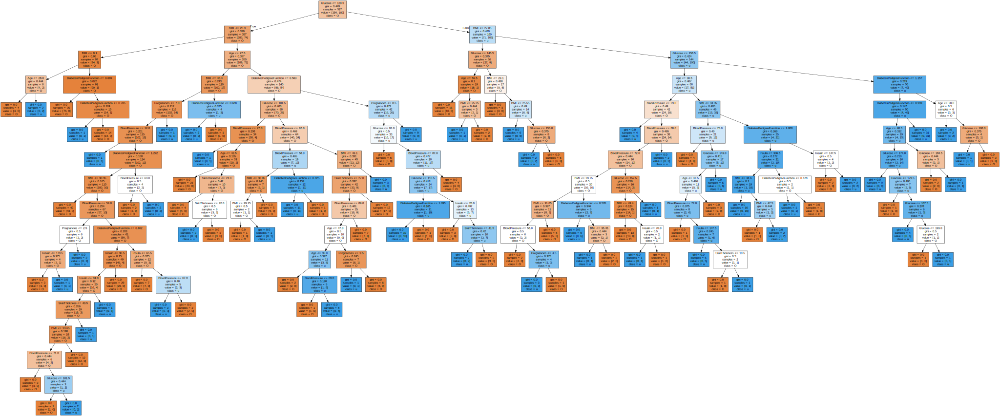
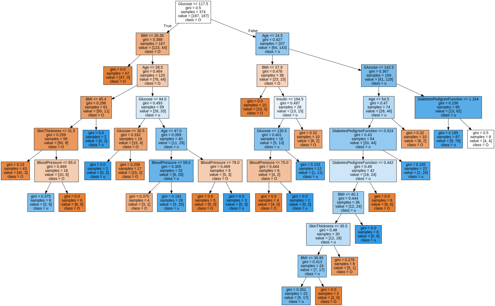

<head>
  <style>
    table.dataframe {
      white-space: normal;
      width: 100%;
      height: 240px;
      display: block;
      overflow: auto;
      font-family: Arial, sans-serif;
      font-size: 0.9rem;
      line-height: 20px;
      text-align: center;
      border: 0px !important;
    }
    
    table.dataframe th {
      text-align: center;
      font-weight: bold;
      padding: 8px;
    }
    
    table.dataframe td {
      text-align: center;
      padding: 8px;
    }
    
    table.dataframe tr:hover {
      background: #b8d1f3; 
    }
    
    .output_prompt {
      overflow: auto;
      font-size: 0.9rem;
      line-height: 1.45;
      border-radius: 0.3rem;
      -webkit-overflow-scrolling: touch;
      padding: 0.8rem;
      margin-top: 0;
      margin-bottom: 15px;
      font: 1rem Consolas, "Liberation Mono", Menlo, Courier, monospace;
      color: $code-text-color;
      border: solid 1px $border-color;
      border-radius: 0.3rem;
      word-break: normal;
      white-space: pre;
    }

  .dataframe tbody tr th:only-of-type {
      vertical-align: middle;
  }

  .dataframe tbody tr th {
      vertical-align: top;
  }

  .dataframe thead th {
      text-align: center !important;
      padding: 8px;
  }

  .page__content p {
      margin: 0 0 0px !important;
  }

  .page__content p > strong {
    font-size: 0.8rem !important;
  }

  </style>
</head>


# Import Library


```python
import pandas as pd
from sklearn.tree import DecisionTreeClassifier
from sklearn.model_selection import train_test_split
from sklearn import metrics
from sklearn.metrics import accuracy_score
from sklearn.utils import shuffle

import numpy as np

import matplotlib.pyplot as plt
```

# Data Load

- 데이터 출처 : [Pima Indians Diabetes Database](https://www.kaggle.com/uciml/pima-indians-diabetes-database)


> Data Explain

- pima indian의 사람들을 대상으로 여러 정보를 취합하여 당뇨병의 유무를 진단하기 위한 데이터

- 수집 대상은 21세 이상의 여성이다.


```python
data = pd.read_csv('diabetes.csv')
```


```python
data.head()
```


  <div id="df-74328efa-37a6-4d99-b333-041fc74266c6">
    <div class="colab-df-container">
      <div>
<style scoped>
    .dataframe tbody tr th:only-of-type {
        vertical-align: middle;
    }
    
    .dataframe tbody tr th {
        vertical-align: top;
    }
    
    .dataframe thead th {
        text-align: right;
    }
</style>
<table border="1" class="dataframe">
  <thead>
    <tr style="text-align: right;">
      <th></th>
      <th>Pregnancies</th>
      <th>Glucose</th>
      <th>BloodPressure</th>
      <th>SkinThickness</th>
      <th>Insulin</th>
      <th>BMI</th>
      <th>DiabetesPedigreeFunction</th>
      <th>Age</th>
      <th>Outcome</th>
    </tr>
  </thead>
  <tbody>
    <tr>
      <th>0</th>
      <td>6</td>
      <td>148</td>
      <td>72</td>
      <td>35</td>
      <td>0</td>
      <td>33.6</td>
      <td>0.627</td>
      <td>50</td>
      <td>1</td>
    </tr>
    <tr>
      <th>1</th>
      <td>1</td>
      <td>85</td>
      <td>66</td>
      <td>29</td>
      <td>0</td>
      <td>26.6</td>
      <td>0.351</td>
      <td>31</td>
      <td>0</td>
    </tr>
    <tr>
      <th>2</th>
      <td>8</td>
      <td>183</td>
      <td>64</td>
      <td>0</td>
      <td>0</td>
      <td>23.3</td>
      <td>0.672</td>
      <td>32</td>
      <td>1</td>
    </tr>
    <tr>
      <th>3</th>
      <td>1</td>
      <td>89</td>
      <td>66</td>
      <td>23</td>
      <td>94</td>
      <td>28.1</td>
      <td>0.167</td>
      <td>21</td>
      <td>0</td>
    </tr>
    <tr>
      <th>4</th>
      <td>0</td>
      <td>137</td>
      <td>40</td>
      <td>35</td>
      <td>168</td>
      <td>43.1</td>
      <td>2.288</td>
      <td>33</td>
      <td>1</td>
    </tr>
  </tbody>
</table>
</div>
      <button class="colab-df-convert" onclick="convertToInteractive('df-74328efa-37a6-4d99-b333-041fc74266c6')"
              title="Convert this dataframe to an interactive table."
              style="display:none;">

  <svg xmlns="http://www.w3.org/2000/svg" height="24px"viewBox="0 0 24 24"
       width="24px">
    <path d="M0 0h24v24H0V0z" fill="none"/>
    <path d="M18.56 5.44l.94 2.06.94-2.06 2.06-.94-2.06-.94-.94-2.06-.94 2.06-2.06.94zm-11 1L8.5 8.5l.94-2.06 2.06-.94-2.06-.94L8.5 2.5l-.94 2.06-2.06.94zm10 10l.94 2.06.94-2.06 2.06-.94-2.06-.94-.94-2.06-.94 2.06-2.06.94z"/><path d="M17.41 7.96l-1.37-1.37c-.4-.4-.92-.59-1.43-.59-.52 0-1.04.2-1.43.59L10.3 9.45l-7.72 7.72c-.78.78-.78 2.05 0 2.83L4 21.41c.39.39.9.59 1.41.59.51 0 1.02-.2 1.41-.59l7.78-7.78 2.81-2.81c.8-.78.8-2.07 0-2.86zM5.41 20L4 18.59l7.72-7.72 1.47 1.35L5.41 20z"/>
  </svg>
      </button>

  <style>
    .colab-df-container {
      display:flex;
      flex-wrap:wrap;
      gap: 12px;
    }
    
    .colab-df-convert {
      background-color: #E8F0FE;
      border: none;
      border-radius: 50%;
      cursor: pointer;
      display: none;
      fill: #1967D2;
      height: 32px;
      padding: 0 0 0 0;
      width: 32px;
    }
    
    .colab-df-convert:hover {
      background-color: #E2EBFA;
      box-shadow: 0px 1px 2px rgba(60, 64, 67, 0.3), 0px 1px 3px 1px rgba(60, 64, 67, 0.15);
      fill: #174EA6;
    }
    
    [theme=dark] .colab-df-convert {
      background-color: #3B4455;
      fill: #D2E3FC;
    }
    
    [theme=dark] .colab-df-convert:hover {
      background-color: #434B5C;
      box-shadow: 0px 1px 3px 1px rgba(0, 0, 0, 0.15);
      filter: drop-shadow(0px 1px 2px rgba(0, 0, 0, 0.3));
      fill: #FFFFFF;
    }
  </style>

      <script>
        const buttonEl =
          document.querySelector('#df-74328efa-37a6-4d99-b333-041fc74266c6 button.colab-df-convert');
        buttonEl.style.display =
          google.colab.kernel.accessAllowed ? 'block' : 'none';
    
        async function convertToInteractive(key) {
          const element = document.querySelector('#df-74328efa-37a6-4d99-b333-041fc74266c6');
          const dataTable =
            await google.colab.kernel.invokeFunction('convertToInteractive',
                                                     [key], {});
          if (!dataTable) return;
    
          const docLinkHtml = 'Like what you see? Visit the ' +
            '<a target="_blank" href=https://colab.research.google.com/notebooks/data_table.ipynb>data table notebook</a>'
            + ' to learn more about interactive tables.';
          element.innerHTML = '';
          dataTable['output_type'] = 'display_data';
          await google.colab.output.renderOutput(dataTable, element);
          const docLink = document.createElement('div');
          docLink.innerHTML = docLinkHtml;
          element.appendChild(docLink);
        }
      </script>
    </div>
  </div>


> Data Feature Information

- Pregnancies : 임신 횟수

- Glucose : 혈당 (보통 공복 후 측정한 혈당이 126 mg/dL 이상인 경우 당뇨병으로 진단), 즉 굉장히 중요한 feature

- Blood Pressure : 혈압

- Skin Thickness : 피부 두께

- Insulin : 인슐린 분비량

- BMI : 체질량 지수

- Diabetes Pedigree Function : 당뇨 혈통 기능? (당뇨의 유전을 이야기 하는 듯?)

- Age : 나이


```python
col_names = list(data.columns)

feature = col_names[:-1]
label = col_names[-1]
```


```python
print("당뇨 여부 class : ", col_names[-1])
```

<pre>
당뇨 여부 class :  Outcome
</pre>
# Data Exploration


### Find Null


```python
data.shape
```

<pre>
(768, 9)
</pre>

```python
pd.isnull(data).sum()
```

<pre>
Pregnancies                 0
Glucose                     0
BloodPressure               0
SkinThickness               0
Insulin                     0
BMI                         0
DiabetesPedigreeFunction    0
Age                         0
Outcome                     0
dtype: int64
</pre>
### Data Type


```python
data.dtypes
```

<pre>
Pregnancies                   int64
Glucose                       int64
BloodPressure                 int64
SkinThickness                 int64
Insulin                       int64
BMI                         float64
DiabetesPedigreeFunction    float64
Age                           int64
Outcome                       int64
dtype: object
</pre>
> class를 나타내는 Outcome을 제외하면 모두 연속형 변수이다.


### Class Ratio


```python
group = data.groupby('Outcome')
```


```python
print("당뇨병   : ", group.count()['Age'][1])
print("당뇨병 X : ", group.count()['Age'][0])
```

<pre>
당뇨병   :  268
당뇨병 X :  500
</pre>
> 수집된 데이터에서 당뇨병 환자가 환자가 아닌 경우에 비해 절반이다. 데이터가 불균형하기 때문에 훈련 할 때에는 균형을 맞출 필요가 있다.


### 당뇨병 vs 정상


```python
group.apply(lambda x : x.describe())[feature]
```


  <div id="df-08702486-9d49-4fbc-b72c-7089bafb66af">
    <div class="colab-df-container">
      <div>
<style scoped>
    .dataframe tbody tr th:only-of-type {
        vertical-align: middle;
    }
    
    .dataframe tbody tr th {
        vertical-align: top;
    }
    
    .dataframe thead th {
        text-align: right;
    }
</style>
<table border="1" class="dataframe">
  <thead>
    <tr style="text-align: right;">
      <th></th>
      <th></th>
      <th>Pregnancies</th>
      <th>Glucose</th>
      <th>BloodPressure</th>
      <th>SkinThickness</th>
      <th>Insulin</th>
      <th>BMI</th>
      <th>DiabetesPedigreeFunction</th>
      <th>Age</th>
    </tr>
    <tr>
      <th>Outcome</th>
      <th></th>
      <th></th>
      <th></th>
      <th></th>
      <th></th>
      <th></th>
      <th></th>
      <th></th>
      <th></th>
    </tr>
  </thead>
  <tbody>
    <tr>
      <th rowspan="8" valign="top">0</th>
      <th>count</th>
      <td>500.000000</td>
      <td>500.000000</td>
      <td>500.000000</td>
      <td>500.000000</td>
      <td>500.000000</td>
      <td>500.000000</td>
      <td>500.000000</td>
      <td>500.000000</td>
    </tr>
    <tr>
      <th>mean</th>
      <td>3.298000</td>
      <td>109.980000</td>
      <td>68.184000</td>
      <td>19.664000</td>
      <td>68.792000</td>
      <td>30.304200</td>
      <td>0.429734</td>
      <td>31.190000</td>
    </tr>
    <tr>
      <th>std</th>
      <td>3.017185</td>
      <td>26.141200</td>
      <td>18.063075</td>
      <td>14.889947</td>
      <td>98.865289</td>
      <td>7.689855</td>
      <td>0.299085</td>
      <td>11.667655</td>
    </tr>
    <tr>
      <th>min</th>
      <td>0.000000</td>
      <td>0.000000</td>
      <td>0.000000</td>
      <td>0.000000</td>
      <td>0.000000</td>
      <td>0.000000</td>
      <td>0.078000</td>
      <td>21.000000</td>
    </tr>
    <tr>
      <th>25%</th>
      <td>1.000000</td>
      <td>93.000000</td>
      <td>62.000000</td>
      <td>0.000000</td>
      <td>0.000000</td>
      <td>25.400000</td>
      <td>0.229750</td>
      <td>23.000000</td>
    </tr>
    <tr>
      <th>50%</th>
      <td>2.000000</td>
      <td>107.000000</td>
      <td>70.000000</td>
      <td>21.000000</td>
      <td>39.000000</td>
      <td>30.050000</td>
      <td>0.336000</td>
      <td>27.000000</td>
    </tr>
    <tr>
      <th>75%</th>
      <td>5.000000</td>
      <td>125.000000</td>
      <td>78.000000</td>
      <td>31.000000</td>
      <td>105.000000</td>
      <td>35.300000</td>
      <td>0.561750</td>
      <td>37.000000</td>
    </tr>
    <tr>
      <th>max</th>
      <td>13.000000</td>
      <td>197.000000</td>
      <td>122.000000</td>
      <td>60.000000</td>
      <td>744.000000</td>
      <td>57.300000</td>
      <td>2.329000</td>
      <td>81.000000</td>
    </tr>
    <tr>
      <th rowspan="8" valign="top">1</th>
      <th>count</th>
      <td>268.000000</td>
      <td>268.000000</td>
      <td>268.000000</td>
      <td>268.000000</td>
      <td>268.000000</td>
      <td>268.000000</td>
      <td>268.000000</td>
      <td>268.000000</td>
    </tr>
    <tr>
      <th>mean</th>
      <td>4.865672</td>
      <td>141.257463</td>
      <td>70.824627</td>
      <td>22.164179</td>
      <td>100.335821</td>
      <td>35.142537</td>
      <td>0.550500</td>
      <td>37.067164</td>
    </tr>
    <tr>
      <th>std</th>
      <td>3.741239</td>
      <td>31.939622</td>
      <td>21.491812</td>
      <td>17.679711</td>
      <td>138.689125</td>
      <td>7.262967</td>
      <td>0.372354</td>
      <td>10.968254</td>
    </tr>
    <tr>
      <th>min</th>
      <td>0.000000</td>
      <td>0.000000</td>
      <td>0.000000</td>
      <td>0.000000</td>
      <td>0.000000</td>
      <td>0.000000</td>
      <td>0.088000</td>
      <td>21.000000</td>
    </tr>
    <tr>
      <th>25%</th>
      <td>1.750000</td>
      <td>119.000000</td>
      <td>66.000000</td>
      <td>0.000000</td>
      <td>0.000000</td>
      <td>30.800000</td>
      <td>0.262500</td>
      <td>28.000000</td>
    </tr>
    <tr>
      <th>50%</th>
      <td>4.000000</td>
      <td>140.000000</td>
      <td>74.000000</td>
      <td>27.000000</td>
      <td>0.000000</td>
      <td>34.250000</td>
      <td>0.449000</td>
      <td>36.000000</td>
    </tr>
    <tr>
      <th>75%</th>
      <td>8.000000</td>
      <td>167.000000</td>
      <td>82.000000</td>
      <td>36.000000</td>
      <td>167.250000</td>
      <td>38.775000</td>
      <td>0.728000</td>
      <td>44.000000</td>
    </tr>
    <tr>
      <th>max</th>
      <td>17.000000</td>
      <td>199.000000</td>
      <td>114.000000</td>
      <td>99.000000</td>
      <td>846.000000</td>
      <td>67.100000</td>
      <td>2.420000</td>
      <td>70.000000</td>
    </tr>
  </tbody>
</table>
</div>
      <button class="colab-df-convert" onclick="convertToInteractive('df-08702486-9d49-4fbc-b72c-7089bafb66af')"
              title="Convert this dataframe to an interactive table."
              style="display:none;">

  <svg xmlns="http://www.w3.org/2000/svg" height="24px"viewBox="0 0 24 24"
       width="24px">
    <path d="M0 0h24v24H0V0z" fill="none"/>
    <path d="M18.56 5.44l.94 2.06.94-2.06 2.06-.94-2.06-.94-.94-2.06-.94 2.06-2.06.94zm-11 1L8.5 8.5l.94-2.06 2.06-.94-2.06-.94L8.5 2.5l-.94 2.06-2.06.94zm10 10l.94 2.06.94-2.06 2.06-.94-2.06-.94-.94-2.06-.94 2.06-2.06.94z"/><path d="M17.41 7.96l-1.37-1.37c-.4-.4-.92-.59-1.43-.59-.52 0-1.04.2-1.43.59L10.3 9.45l-7.72 7.72c-.78.78-.78 2.05 0 2.83L4 21.41c.39.39.9.59 1.41.59.51 0 1.02-.2 1.41-.59l7.78-7.78 2.81-2.81c.8-.78.8-2.07 0-2.86zM5.41 20L4 18.59l7.72-7.72 1.47 1.35L5.41 20z"/>
  </svg>
      </button>

  <style>
    .colab-df-container {
      display:flex;
      flex-wrap:wrap;
      gap: 12px;
    }
    
    .colab-df-convert {
      background-color: #E8F0FE;
      border: none;
      border-radius: 50%;
      cursor: pointer;
      display: none;
      fill: #1967D2;
      height: 32px;
      padding: 0 0 0 0;
      width: 32px;
    }
    
    .colab-df-convert:hover {
      background-color: #E2EBFA;
      box-shadow: 0px 1px 2px rgba(60, 64, 67, 0.3), 0px 1px 3px 1px rgba(60, 64, 67, 0.15);
      fill: #174EA6;
    }
    
    [theme=dark] .colab-df-convert {
      background-color: #3B4455;
      fill: #D2E3FC;
    }
    
    [theme=dark] .colab-df-convert:hover {
      background-color: #434B5C;
      box-shadow: 0px 1px 3px 1px rgba(0, 0, 0, 0.15);
      filter: drop-shadow(0px 1px 2px rgba(0, 0, 0, 0.3));
      fill: #FFFFFF;
    }
  </style>

      <script>
        const buttonEl =
          document.querySelector('#df-08702486-9d49-4fbc-b72c-7089bafb66af button.colab-df-convert');
        buttonEl.style.display =
          google.colab.kernel.accessAllowed ? 'block' : 'none';
    
        async function convertToInteractive(key) {
          const element = document.querySelector('#df-08702486-9d49-4fbc-b72c-7089bafb66af');
          const dataTable =
            await google.colab.kernel.invokeFunction('convertToInteractive',
                                                     [key], {});
          if (!dataTable) return;
    
          const docLinkHtml = 'Like what you see? Visit the ' +
            '<a target="_blank" href=https://colab.research.google.com/notebooks/data_table.ipynb>data table notebook</a>'
            + ' to learn more about interactive tables.';
          element.innerHTML = '';
          dataTable['output_type'] = 'display_data';
          await google.colab.output.renderOutput(dataTable, element);
          const docLink = document.createElement('div');
          docLink.innerHTML = docLinkHtml;
          element.appendChild(docLink);
        }
      </script>
    </div>
  </div>


```python
group.mean()
```


  <div id="df-ae0a0173-665a-4e15-a363-869646c3ce9a">
    <div class="colab-df-container">
      <div>
<style scoped>
    .dataframe tbody tr th:only-of-type {
        vertical-align: middle;
    }
    
    .dataframe tbody tr th {
        vertical-align: top;
    }
    
    .dataframe thead th {
        text-align: right;
    }
</style>
<table border="1" class="dataframe">
  <thead>
    <tr style="text-align: right;">
      <th></th>
      <th>Pregnancies</th>
      <th>Glucose</th>
      <th>BloodPressure</th>
      <th>SkinThickness</th>
      <th>Insulin</th>
      <th>BMI</th>
      <th>DiabetesPedigreeFunction</th>
      <th>Age</th>
    </tr>
    <tr>
      <th>Outcome</th>
      <th></th>
      <th></th>
      <th></th>
      <th></th>
      <th></th>
      <th></th>
      <th></th>
      <th></th>
    </tr>
  </thead>
  <tbody>
    <tr>
      <th>0</th>
      <td>3.298000</td>
      <td>109.980000</td>
      <td>68.184000</td>
      <td>19.664000</td>
      <td>68.792000</td>
      <td>30.304200</td>
      <td>0.429734</td>
      <td>31.190000</td>
    </tr>
    <tr>
      <th>1</th>
      <td>4.865672</td>
      <td>141.257463</td>
      <td>70.824627</td>
      <td>22.164179</td>
      <td>100.335821</td>
      <td>35.142537</td>
      <td>0.550500</td>
      <td>37.067164</td>
    </tr>
  </tbody>
</table>
</div>
      <button class="colab-df-convert" onclick="convertToInteractive('df-ae0a0173-665a-4e15-a363-869646c3ce9a')"
              title="Convert this dataframe to an interactive table."
              style="display:none;">

  <svg xmlns="http://www.w3.org/2000/svg" height="24px"viewBox="0 0 24 24"
       width="24px">
    <path d="M0 0h24v24H0V0z" fill="none"/>
    <path d="M18.56 5.44l.94 2.06.94-2.06 2.06-.94-2.06-.94-.94-2.06-.94 2.06-2.06.94zm-11 1L8.5 8.5l.94-2.06 2.06-.94-2.06-.94L8.5 2.5l-.94 2.06-2.06.94zm10 10l.94 2.06.94-2.06 2.06-.94-2.06-.94-.94-2.06-.94 2.06-2.06.94z"/><path d="M17.41 7.96l-1.37-1.37c-.4-.4-.92-.59-1.43-.59-.52 0-1.04.2-1.43.59L10.3 9.45l-7.72 7.72c-.78.78-.78 2.05 0 2.83L4 21.41c.39.39.9.59 1.41.59.51 0 1.02-.2 1.41-.59l7.78-7.78 2.81-2.81c.8-.78.8-2.07 0-2.86zM5.41 20L4 18.59l7.72-7.72 1.47 1.35L5.41 20z"/>
  </svg>
      </button>

  <style>
    .colab-df-container {
      display:flex;
      flex-wrap:wrap;
      gap: 12px;
    }
    
    .colab-df-convert {
      background-color: #E8F0FE;
      border: none;
      border-radius: 50%;
      cursor: pointer;
      display: none;
      fill: #1967D2;
      height: 32px;
      padding: 0 0 0 0;
      width: 32px;
    }
    
    .colab-df-convert:hover {
      background-color: #E2EBFA;
      box-shadow: 0px 1px 2px rgba(60, 64, 67, 0.3), 0px 1px 3px 1px rgba(60, 64, 67, 0.15);
      fill: #174EA6;
    }
    
    [theme=dark] .colab-df-convert {
      background-color: #3B4455;
      fill: #D2E3FC;
    }
    
    [theme=dark] .colab-df-convert:hover {
      background-color: #434B5C;
      box-shadow: 0px 1px 3px 1px rgba(0, 0, 0, 0.15);
      filter: drop-shadow(0px 1px 2px rgba(0, 0, 0, 0.3));
      fill: #FFFFFF;
    }
  </style>

      <script>
        const buttonEl =
          document.querySelector('#df-ae0a0173-665a-4e15-a363-869646c3ce9a button.colab-df-convert');
        buttonEl.style.display =
          google.colab.kernel.accessAllowed ? 'block' : 'none';
    
        async function convertToInteractive(key) {
          const element = document.querySelector('#df-ae0a0173-665a-4e15-a363-869646c3ce9a');
          const dataTable =
            await google.colab.kernel.invokeFunction('convertToInteractive',
                                                     [key], {});
          if (!dataTable) return;
    
          const docLinkHtml = 'Like what you see? Visit the ' +
            '<a target="_blank" href=https://colab.research.google.com/notebooks/data_table.ipynb>data table notebook</a>'
            + ' to learn more about interactive tables.';
          element.innerHTML = '';
          dataTable['output_type'] = 'display_data';
          await google.colab.output.renderOutput(dataTable, element);
          const docLink = document.createElement('div');
          docLink.innerHTML = docLinkHtml;
          element.appendChild(docLink);
        }
      </script>
    </div>
  </div>


> 당뇨병이 있는 사람은 기본적으로 모두 다 높게 나오는 편이다. 특히 혈당과 인슐린 수치, BMI에서 큰 차이를 보인다.


# Data Preprocessing


```python
x_train, x_test, y_train, y_test = train_test_split(data[feature], data[label], test_size=0.3, random_state=1)
```


```python
x_train.head(3)
```


  <div id="df-493b3358-38fb-41fa-9c18-3e735fc09528">
    <div class="colab-df-container">
      <div>
<style scoped>
    .dataframe tbody tr th:only-of-type {
        vertical-align: middle;
    }
    
    .dataframe tbody tr th {
        vertical-align: top;
    }
    
    .dataframe thead th {
        text-align: right;
    }
</style>
<table border="1" class="dataframe">
  <thead>
    <tr style="text-align: right;">
      <th></th>
      <th>Pregnancies</th>
      <th>Glucose</th>
      <th>BloodPressure</th>
      <th>SkinThickness</th>
      <th>Insulin</th>
      <th>BMI</th>
      <th>DiabetesPedigreeFunction</th>
      <th>Age</th>
    </tr>
  </thead>
  <tbody>
    <tr>
      <th>88</th>
      <td>15</td>
      <td>136</td>
      <td>70</td>
      <td>32</td>
      <td>110</td>
      <td>37.1</td>
      <td>0.153</td>
      <td>43</td>
    </tr>
    <tr>
      <th>467</th>
      <td>0</td>
      <td>97</td>
      <td>64</td>
      <td>36</td>
      <td>100</td>
      <td>36.8</td>
      <td>0.600</td>
      <td>25</td>
    </tr>
    <tr>
      <th>550</th>
      <td>1</td>
      <td>116</td>
      <td>70</td>
      <td>28</td>
      <td>0</td>
      <td>27.4</td>
      <td>0.204</td>
      <td>21</td>
    </tr>
  </tbody>
</table>
</div>
      <button class="colab-df-convert" onclick="convertToInteractive('df-493b3358-38fb-41fa-9c18-3e735fc09528')"
              title="Convert this dataframe to an interactive table."
              style="display:none;">

  <svg xmlns="http://www.w3.org/2000/svg" height="24px"viewBox="0 0 24 24"
       width="24px">
    <path d="M0 0h24v24H0V0z" fill="none"/>
    <path d="M18.56 5.44l.94 2.06.94-2.06 2.06-.94-2.06-.94-.94-2.06-.94 2.06-2.06.94zm-11 1L8.5 8.5l.94-2.06 2.06-.94-2.06-.94L8.5 2.5l-.94 2.06-2.06.94zm10 10l.94 2.06.94-2.06 2.06-.94-2.06-.94-.94-2.06-.94 2.06-2.06.94z"/><path d="M17.41 7.96l-1.37-1.37c-.4-.4-.92-.59-1.43-.59-.52 0-1.04.2-1.43.59L10.3 9.45l-7.72 7.72c-.78.78-.78 2.05 0 2.83L4 21.41c.39.39.9.59 1.41.59.51 0 1.02-.2 1.41-.59l7.78-7.78 2.81-2.81c.8-.78.8-2.07 0-2.86zM5.41 20L4 18.59l7.72-7.72 1.47 1.35L5.41 20z"/>
  </svg>
      </button>

  <style>
    .colab-df-container {
      display:flex;
      flex-wrap:wrap;
      gap: 12px;
    }
    
    .colab-df-convert {
      background-color: #E8F0FE;
      border: none;
      border-radius: 50%;
      cursor: pointer;
      display: none;
      fill: #1967D2;
      height: 32px;
      padding: 0 0 0 0;
      width: 32px;
    }
    
    .colab-df-convert:hover {
      background-color: #E2EBFA;
      box-shadow: 0px 1px 2px rgba(60, 64, 67, 0.3), 0px 1px 3px 1px rgba(60, 64, 67, 0.15);
      fill: #174EA6;
    }
    
    [theme=dark] .colab-df-convert {
      background-color: #3B4455;
      fill: #D2E3FC;
    }
    
    [theme=dark] .colab-df-convert:hover {
      background-color: #434B5C;
      box-shadow: 0px 1px 3px 1px rgba(0, 0, 0, 0.15);
      filter: drop-shadow(0px 1px 2px rgba(0, 0, 0, 0.3));
      fill: #FFFFFF;
    }
  </style>

      <script>
        const buttonEl =
          document.querySelector('#df-493b3358-38fb-41fa-9c18-3e735fc09528 button.colab-df-convert');
        buttonEl.style.display =
          google.colab.kernel.accessAllowed ? 'block' : 'none';
    
        async function convertToInteractive(key) {
          const element = document.querySelector('#df-493b3358-38fb-41fa-9c18-3e735fc09528');
          const dataTable =
            await google.colab.kernel.invokeFunction('convertToInteractive',
                                                     [key], {});
          if (!dataTable) return;
    
          const docLinkHtml = 'Like what you see? Visit the ' +
            '<a target="_blank" href=https://colab.research.google.com/notebooks/data_table.ipynb>data table notebook</a>'
            + ' to learn more about interactive tables.';
          element.innerHTML = '';
          dataTable['output_type'] = 'display_data';
          await google.colab.output.renderOutput(dataTable, element);
          const docLink = document.createElement('div');
          docLink.innerHTML = docLinkHtml;
          element.appendChild(docLink);
        }
      </script>
    </div>
  </div>


```python
y_train.head(3)
```

<pre>
88     1
467    0
550    0
Name: Outcome, dtype: int64
</pre>

```python
# 분리된 데이터에서의 클래스 분포
print("당뇨병   : ", sum(y_test))
print("당뇨병 X : ", len(y_test) - sum(y_test))
```

<pre>
당뇨병   :  85
당뇨병 X :  146
</pre>
> train_test_split 함수는 클래스의 비율을 균등하게 유지하지 못한다. 우리는 이것을 인지하고 데이터를 다시 구성하려고 한다.


```python
x_train, x_test, y_train, y_test = train_test_split(data[feature], data[label], test_size=0.3, random_state=1, stratify=data[label])
```


```python
268 * 0.7
```

<pre>
187.6
</pre>

```python
data_shuffled = shuffle(data)
```


```python
eq_train_x_0 = data_shuffled[data_shuffled['Outcome'] == 0][feature][:187]
eq_train_x_1 = data_shuffled[data_shuffled['Outcome'] == 1][feature][:187]

eq_train_x = pd.concat([eq_train_x_0, eq_train_x_1])
eq_train_y = np.concatenate(([0] * len(eq_train_x_0), [1] * len(eq_train_x_1)), axis=0)

eq_test_x_0 = data_shuffled[data_shuffled['Outcome'] == 0][feature][187:]
eq_test_x_1 = data_shuffled[data_shuffled['Outcome'] == 1][feature][187:]

eq_test_x = pd.concat([eq_test_x_0, eq_test_x_1])
eq_test_y = np.concatenate(([0] * len(eq_test_x_0), [1] * len(eq_test_x_1)), axis=0)
```


```python
print(eq_train_x.shape, len(eq_train_y))
print(eq_test_x.shape, len(eq_test_y))
```

<pre>
(374, 8) 374
(394, 8) 394
</pre>
# Modeling


### Model 1


```python
clf = DecisionTreeClassifier()
clf.fit(x_train, y_train)

y_pred = clf.predict(x_test)
```

### Model 2


```python
clf2 = DecisionTreeClassifier()
clf2.fit(eq_train_x, eq_train_y)

y_pred2 = clf2.predict(eq_test_x)
```

# Model Evaluation


```python
print('accuracy : ', accuracy_score(y_test, y_pred))
```

<pre>
accuracy :  0.6926406926406926
</pre>

```python
print('accuracy : ', accuracy_score(eq_test_y, y_pred2))
```

<pre>
accuracy :  0.6954314720812182
</pre>
> ~~엥? 더 떨어졌네?? ㅋㅋㅋ~~ (학습 데이터의 클래스를 잘못 할당함... ㅋㅋ)  

그래도 비슷한 성능을 보인다..


# Model Visualization


```python
from sklearn import tree
import graphviz
```


```python
dot_data = tree.export_graphviz(clf, out_file = None,
                                feature_names = feature,  
                                class_names = label,
                                filled = True)
```


```python
graph = graphviz.Source(dot_data, format="png") 
graph
```



```python
# !pip install dtreeviz
```

```python
from dtreeviz.trees import dtreeviz

viz = dtreeviz(clf, x_train, y_train,
                target_name = "target",
                feature_names = feature,
                class_names = label)

viz
```


# Decision Tree 가지치기


### Post Pruning


```python
path = clf2.cost_complexity_pruning_path(eq_train_x, eq_train_y)
ccp_alphas, impurities = path.ccp_alphas, path.impurities
print(ccp_alphas)
```

<pre>
[0.         0.00200104 0.00237671 0.00237671 0.00245098 0.00247574
 0.00250668 0.00259952 0.00320856 0.00330579 0.00356506 0.00380273
 0.00380273 0.0039287  0.0040107  0.00413223 0.00442096 0.00442356
 0.00445633 0.00445633 0.00445633 0.00452227 0.00486223 0.00534759
 0.00585399 0.00590463 0.00616089 0.00713012 0.00727867 0.00745021
 0.00773491 0.00828877 0.0084237  0.00937527 0.01051288 0.01099147
 0.01130835 0.01297752 0.0182325  0.0218201  0.0230369  0.02428085
 0.09026874]
</pre>

```python
# For each alpha we will append our model to a list
clfs = []
for ccp_alpha in ccp_alphas:
    clf = tree.DecisionTreeClassifier(random_state=0, ccp_alpha=ccp_alpha)
    clf.fit(eq_train_x, eq_train_y)
    clfs.append(clf)
```


```python
clfs = clfs[:-1]
ccp_alphas = ccp_alphas[:-1]
node_counts = [clf.tree_.node_count for clf in clfs]
depth = [clf.tree_.max_depth for clf in clfs]
plt.scatter(ccp_alphas,node_counts)
plt.scatter(ccp_alphas,depth)
plt.plot(ccp_alphas,node_counts,label='no of nodes',drawstyle="steps-post")
plt.plot(ccp_alphas,depth,label='depth',drawstyle="steps-post")
plt.legend()
plt.show()
```

<img src="data:image/png;base64,iVBORw0KGgoAAAANSUhEUgAAAX8AAAD4CAYAAAAEhuazAAAABHNCSVQICAgIfAhkiAAAAAlwSFlzAAALEgAACxIB0t1+/AAAADh0RVh0U29mdHdhcmUAbWF0cGxvdGxpYiB2ZXJzaW9uMy4yLjIsIGh0dHA6Ly9tYXRwbG90bGliLm9yZy+WH4yJAAAgAElEQVR4nO3df3hU1b3v8feXGCBYJSqxVxMo0FJaECSSKq0/WuVe0GoltRa1raK1RWtr7z2nVyptL2If+0gP3mNrbWut2tIWEVQatOqhfUSv1SqeIBEU5QiimIglgMFf4VfyvX/MTJgks5PM7PmZ+byeJ08ma/aPtRj97j1rr/Vd5u6IiEhxGZDrCoiISPYp+IuIFCEFfxGRIqTgLyJShBT8RUSK0CG5rgDAsGHDfOTIkbmuhohIQVmzZs0Od69IZd+8CP4jR46kvr4+19UQESkoZvZ6qvuq20dEpAgp+IuIFCEFfxGRIpQXff4iUjj2799PY2Mje/bsyXVVisbgwYOpqqqitLQ0bcdU8BeRpDQ2NnLYYYcxcuRIzCzX1en33J2dO3fS2NjIqFGj0nbcgg3+dWubWLhyI2+2tHJseRnXTB9LbXVlrqsl0u/t2bNHgT+LzIyjjjqK5ubmtB63IIN/3dom5i5fT+v+NgCaWlqZu3w9gC4AIlmgwJ9dmfj3Lsjgv3Dlxo7AH9O6v405961jybNbM3LOGZMq+cpJIzJybBGRbCvI0T5vtrQmLN/X1p6R823Y9g4rGpoycmwRyQ/Nzc2cdNJJVFdX8/e//z2txx45ciQ7duxI6zHDKsg7/2PLy2hKcAGoLC9j6RWfTvv5LvjN02k/pojkl0cffZQJEyZwxx135LoqWVGQd/7XTB9LWWlJp7Ky0hKumT42RzUSkWx57bXX+OQnP8k3v/lNxo8fz7Rp02htjdwMNjQ0MGXKFCZOnMgXv/hF3n777YT7n3HGGUycOJGpU6eydetWGhoamDNnDitWrGDSpEkdx4sZOXIk1113HSeccAITJkzg5ZdfBmDXrl3U1tYyceJEpkyZwrp16wDYuXMn06ZNY/z48XzjG98gfsXEP/3pT5x44olMmjSJK664gra2Ntra2rj00ks57rjjmDBhAjfffHOm/vk6FOSdf+yhrkb7iOTW9Q++yIY330nrMccdezjXfWF8j9u88sorLFmyhN/+9rfMnDmT+++/n6997Wtccskl/OIXv+Czn/0s8+bN4/rrr+dnP/tZp32vvvpqZs2axaxZs7jrrrv47ne/S11dHT/+8Y+pr6/n1ltvTXjOYcOG8dxzz/GrX/2Km266iTvuuIPrrruO6upq6urqWLVqFZdccgkNDQ1cf/31nHLKKcybN4+HHnqIO++8E4CXXnqJpUuX8tRTT1FaWspVV13F4sWLGT9+PE1NTbzwwgsAtLS0pOFfsme9Bn8zuws4B9ju7sd1ee97wE1AhbvvsMgj6Z8Dnwc+AC519+fSX+3IBUDBXqQ4jRo1ikmTJgEwefJkXnvtNXbv3k1LSwuf/exnAZg1axZf/vKXu+379NNPs3z5cgAuvvhi5syZ06dznnfeeR3ni+3/5JNPcv/99wNwxhlnsHPnTt555x2eeOKJjm3OPvtsjjjiCCDStbRmzRo+9alPAdDa2srRRx/NF77wBV599VWuvvpqzj77bKZNm5bSv0sy+nLn/3vgVuAP8YVmNhyYBsQPrzkLGBP9OQn4dfS3iPRDvd2hZ8qgQYM6XpeUlHTrpsnkOUtKSjhw4EBKx3B3Zs2axY033tjtveeff56VK1dy2223sWzZMu66665Q9e1Nr33+7v4EsCvBWzcDcwCPK5sB/MEjngHKzeyYtNRURKQHQ4cO5YgjjugYqfPHP/6x41tAvM985jPcc889ACxevJhTTz015XOeeuqpLF68GIDHH3+cYcOGcfjhh3Paaadx9913A/DII490PHuYOnUq9913H9u3bwcizwxef/11duzYQXt7O1/60pe44YYbeO65jHSYdJJSn7+ZzQCa3P35LpMPKoE34v5ujJZtS3CM2cBsgBEjNH5eRMJbtGgRV155JR988AGjR4/md7/7XbdtfvGLX3DZZZexcOFCKioqEm7TV/Pnz+frX/86EydOZMiQISxatAiA6667josuuojx48fzmc98piPGjRs3jhtuuIFp06bR3t5OaWkpv/zlLykrK+Oyyy6jvT0yXD3RN4N0s/in0IEbmY0E/uLux5nZEOAxYJq77zaz14CaaJ//X4AF7v5kdL9Hge+7e48rtdTU1Hg+L+YSG+qZiWGkIoXmpZde4pOf/GSuq1F0Ev27m9kad69J5Xip3Pl/FBgFxO76q4DnzOxEoAkYHrdtVbRMRETySNLj/N19vbsf7e4j3X0kka6dE9z9LeAB4BKLmALsdvduXT4iIpJbvQZ/M1sCPA2MNbNGM7u8h80fBl4FNgG/Ba5KSy1zqG5tE2u3trB6yy5OXrCKurX6IiMiha/Xbh93v6iX90fGvXbg2+GrlR9i2UNjOYOUPVRE+ouCTO+QLT1lD717dWayh4qIZIOCfw96yh6qLJ8iUsgU/HtwbHlZwvKBJfpnE8kX8+fP56abbkp6v4aGBh5++OHQxylUimI9CMoeOvzIxBcFESkcXYN/sVHw70FtdSU3njeByvIyjMh6ATeeN4FhHxrU674ikjk/+clP+PjHP84pp5zCxo0bAdi8eTNnnnkmkydP5tRTT+1Iu3zppZdy5ZVXUlNTw8c//nH+8pe/sG/fPubNm8fSpUuZNGkSS5cuBWDDhg187nOfY/To0dxyyy05a182FGRK52xKlD00U0tFihScR66Ft9an95j/bQKctSDw7TVr1nDPPffQ0NDAgQMHOOGEE5g8eTKzZ8/mtttuY8yYMaxevZqrrrqKVatWAZEc/s8++yybN2/m9NNPZ9OmTd1SOM+fP5+XX36Zxx57jHfffZexY8fyrW99i9LS0vS2L08o+ItIQfn73//OF7/4RYYMGQLAueeey549e/jHP/7RKYXz3r17O17PnDmTAQMGMGbMGEaPHt3xraCrs88+m0GDBjFo0CCOPvpo/vnPf1JVVZXZBuWIgr+IpK6HO/Rsam9vp7y8nIaGhoTvd0lA2e3vmK6polNN3VwI1OcvIgXltNNOo66ujtbWVt59910efPBBhgwZwqhRo7j33nuBSN78559/vmOfe++9l/b2djZv3syrr77K2LFjOeyww3j33Xdz1YycU/BP0o/q1rN6yy5Wb9nFR+c+zI/q0tzfKSI9OuGEE7jgggs4/vjjOeusszpWxVq8eDF33nknxx9/POPHj2fFihUd+4wYMYITTzyRs846i9tuu43Bgwdz+umns2HDhk4PfItJn1I6Z1q+p3SO+VHdev70TPeHvV+bMoIbaifkoEYi2VdoKZ0vvfRSzjnnHM4///xcVyWUdKd01p1/EpasfiOpchGRfKUHvkloC/iWFFQuIrn3+9//PtdVyEu6809CScAIgaBykf4qH7qLi0km/r0V/JNw0UnDE5ZPGX1ElmsikjuDBw9m586dugBkibuzc+dOBg8enNbjqtsnCTfUTmBL83s8tXlXp/Lntu6mbm2TcvxLUaiqqqKxsZHm5uZcV6VoDB48OO2TzRT8k/Tazu5pnlv3t7Fw5UYFfykKpaWljBo1KtfVkJDU7ZOkoBz/QeUiIvmoL2v43mVm283shbiyhWb2spmtM7M/m1l53HtzzWyTmW00s+mZqniuBOX4DyoXEclHfbnz/z1wZpeyvwHHuftE4L+AuQBmNg64EBgf3edXZlZCPxKU4/+a6WNzVCMRkeT1Gvzd/QlgV5eyv7p7LOPRM0DsScQM4B533+vuW4BNwIlprG/OxXL8x1bziuX4V3+/iBSSdDzw/ToQS4xRSeRiENMYLetXaqsrO3L6L73i0zmujYhI8kI98DWzHwIHgMUp7DvbzOrNrF5DxkREsivl4G9mlwLnAF/1g7M9moD4mVBV0bJu3P12d69x95qKiopUqyEiIilIKfib2ZnAHOBcd/8g7q0HgAvNbJCZjQLGAM+Gr6aIiKRTX4Z6LgGeBsaaWaOZXQ7cChwG/M3MGszsNgB3fxFYBmwA/gP4tru3Zaz2OVK3tom1W1tYvWUXJy9YRd3ahF9uRETylvL5J6lubRNzl6+ndf/Ba1pZaYlG/IhI1imffxYtXLmxU+CHg+kdREQKhYJ/kpTeQUT6AwX/JCm9g4j0Bwr+SVJ6BxHpDxT8kxRL71BeVtpRNrhU/4wiUlgUtVK090B7x+u3P9jP3OXrNeRTRAqGgn8KNOJHRAqdgn8KNOJHRAqdgn8KNOJHRAqdgn8KEo34MeD0TyhBnYgUBgX/FNRWV/KlyZVYXJkD969p0kNfESkI6VjMpSg99nIzXbMite5vY8596zoWeomZMamSr5w0InuVExHphe78UxT0cHdfW3unvzdse4cVDfo2ICL5RXf+KTq2vIymBBeAyvKyTks7XvCbp7NZLRGRPtGdf4qU5kFECpmCf4piaR4qy8swInf8XXP6a9EXEclX6vYJoba6MnABl9iiL7FnAE0trcxdvr5jPxGRXNKdf4YoBYSI5DMF/wwJGg2U6CGxiEi29WUB97vMbLuZvRBXdqSZ/c3MXon+PiJabmZ2i5ltMrN1ZnZCJiufz4JSPRio719Ecq4vd/6/B87sUnYt8Ki7jwEejf4NcBYwJvozG/h1eqpZeK6ZPrbTDOAYB+Y/8GK2qyMi0kmvwd/dnwB2dSmeASyKvl4E1MaV/8EjngHKzeyYdFW2kNRWV3abARzT0ro/q3UREekq1T7/D7v7tujrt4APR19XAm/EbdcYLevGzGabWb2Z1Tc3N6dYjfxWGdD1M7BEj1pEJLdCRyF3dwi8ye1pv9vdvcbdayoq+mc2zEQTwQYYDD9SqZ9FJLdSHef/TzM7xt23Rbt1tkfLm4DhcdtVRcuKUmw8/8KVG3mzpZVjy8sYXDqAYR8alOOaiUixSzX4PwDMAhZEf6+IK/+Omd0DnATsjuseKkpdJ4Ip14+I5INeg7+ZLQE+Bwwzs0bgOiJBf5mZXQ68DsyMbv4w8HlgE/ABcFkG6iwiIiH1Gvzd/aKAt6Ym2NaBb4etlIiIZJaGnYiIFCEF/yxSlk8RyRcK/lkSlOVTFwARyQUF/ywJyvKpVA8ikgsK/lkSlOVTqR5EJBcU/LMkKMunUj2ISC4o8mRJolQPAPva2vno3If5Ud36HNRKRIqVlnHMkvhUD10XdGlz50/PbAXghtoJWa+biBQf3flnUW11JU9dewYllijTPyxZ/UbCchGRdFPwz4E2T5wENahcRCTdFPxzIOjOP6hcRCTdFPxz4KKThidVLiKSbnrgmwOxh7pLVr/R0dVz9GGD9LBXRLJGwT9Hbqid0BHsleNfRLJN3T4iIkVIwV9EpAgp+IuIFCEFfxGRIhQq+JvZv5jZi2b2gpktMbPBZjbKzFab2SYzW2pmA9NVWRERSY+Ug7+ZVQLfBWrc/TigBLgQ+Clws7t/DHgbuDwdFRURkfQJ2+1zCFBmZocAQ4BtwBnAfdH3FwG1Ic/Rr2lpRxHJhZSDv7s3ATcBW4kE/d3AGqDF3Q9EN2sEKhPtb2azzazezOqbm5tTrUZB09KOIpIrYbp9jgBmAKOAY4FDgTP7ur+73+7uNe5eU1FRkWo1ClrQ0o4LV27MUY1EpFiE6fb578AWd2929/3AcuBkoDzaDQRQBeg2NkDQ0o5d8/2LiKRbmOC/FZhiZkPMzICpwAbgMeD86DazgBXhqth/BS3taKCuHxHJqDB9/quJPNh9DlgfPdbtwPeBfzWzTcBRwJ1pqGe/dM30sSRK4uygrh8RyahQo33c/Tp3/4S7H+fuF7v7Xnd/1d1PdPePufuX3X1vuirb39RWVxK0fEtQl5CISDpohm+OVQZ0/QR1CYmIpIOCf45dM30sZaUlncrKSku4ZvrYHNVIRIqB8vnnWG11ZBrEwpUbaWppZWDJAG48b0JHuYhIJij454Ha6kpqqys7FnVR4BeRTFO3j4hIEVLwFxEpQgr+IiJFSMFfRKQIKfiLiBQhBf88obz+IpJNCv55QHn9RSTbFPzzQFBe/zn3rePu1VtzVCsR6c8U/PNAUBK3fW3t/ODP69UNJCJpp+CfB3pL4qZuIBFJNwX/PJAouVtXWt5RRNJJuX3yQHxytzdbWpXjX0QyTsE/T8SSuwFMuv6vtLTu77bN0LLSbFdLRPopdfvkIUu0tmMP5SIiyVLwz0MtH3S/6++pXEQkWaGCv5mVm9l9Zvaymb1kZp82syPN7G9m9kr09xHpqmyxCBr9o6UdRSRdwt75/xz4D3f/BHA88BJwLfCou48BHo3+LUm4ZvrYbh/MgGi5iEg6pBz8zWwocBpwJ4C773P3FmAGsCi62SKgNmwli03967to71LWHi0XEUmHMHf+o4Bm4HdmttbM7jCzQ4EPu/u26DZvAR9OtLOZzTazejOrb25uDlGN/mfJ6jeSKhcRSVaY4H8IcALwa3evBt6nSxePuzskHrbu7re7e42711RUVISoRv/T5olH+geVi4gkK0zwbwQa3X119O/7iFwM/mlmxwBEf28PV8XiEzSiUyM9RSRdUg7+7v4W8IaZxZ5CTgU2AA8As6Jls4AVoWpYhIYMTJzqIahcRCRZYWf4Xg0sNrOBwKvAZUQuKMvM7HLgdWBmyHMUnQ/2tSVVLiKSrFDB390bgJoEb00Nc9xid2x5GU0J8vhonL+IpItm+OahRFk+y0pLNM5fRNJGwT8P1VZXcuN5EyiPS+Q2uFQflYikjyJKHtt74OBUr7c/2K8FXUQkbRT885TW9RWRTFLwz1M9reu7okF3/yISjoJ/ngoa2TOwRB+ZiISnSJKnEo34KR1gtLuzessuTl6wqqP/v25tEycvWMWoax/qVC4iEkTLOOapruv6Di0r5f19BzjQFsnv09TSytzl66l/fRf3r2nqeD4QK48/hohIV+Z5kCyspqbG6+vrc12NvHbyglUJJ34FGVgygOoR5R1/z5hUyVdOGpGJqolIjpjZGndPNNG2V+r2KRBBD4CD7GuLDBPd8d5ent2yix/8eb26hESkg4J/gQh6AFwSsKp7ZXkZF504gjdb9nTk1I51CekCICIK/gUiKOXDRScND0wFETRXYOHKjRmvr4jkNwX/AhFL+VBZXoYRubO/8bwJ3FA7IWF5bXVlYFdRsl1IItL/aLRPAamtrkw4gieoXNlBRSSI7vz7sWumj6V0QOdnAgOAD/Yd0JwAkSKnO//+rsvz4HYiSeJAcwJEipmCfz+2cOVG9rf1PI8jlixuybM9J4vTPAGR/kXdPv1YXx/sxuYEBNmw7R0lkxPpZ0Lf+ZtZCVAPNLn7OWY2CrgHOApYA1zs7vvCnkeSF/TAt6vK8jKWXvHpwPcv+M3T6ayWiOSBdNz5/0/gpbi/fwrc7O4fA94GLk/DOSQFieYGdKXlIUWKU6jgb2ZVwNnAHdG/DTgDuC+6ySKgNsw5JHWJ5gZ8bcqIhHMCgtStbWLt1pZumURFpLCF7fb5GTAHOCz691FAi7sfiP7dCCSMLGY2G5gNMGKEHiRmStAcgL6oW9vE3OXrO54JaHSQSP+R8p2/mZ0DbHf3Nans7+63u3uNu9dUVFSkWg3JoKD0EN9b9ry+AYgUuDB3/icD55rZ54HBwOHAz4FyMzskevdfBShKFKig0UJt7voGIFLgUr7zd/e57l7l7iOBC4FV7v5V4DHg/Ohms4AVoWspOdFTGggliBMpbJkY5/994F/NbBORZwB3ZuAckgW9jRZqamlV949IgUrLDF93fxx4PPr6VeDEdBxXcivWpfO9Zc/TFrDim7p/RAqTZvhKj2qrK/m/M48P/AbQur+N+Q+8mOVaiUhYCv7Sq9h8gSAtrfs1B0CkwCj4S5/UVldS2cMDYC0RKVJYlNVT+uya6WOZu3x9t7H/MYkyhCobqEh+0p2/9Fl8uogg8RlClQ1UJH8p+EtSaqsreeraMwIvALEMoUuv+DTjjjk8y7UTkb5S8JeUJJoDEJ8hVAnhRPKb+vwlJbFx/QtXbuTNllaOLS/jmuljqa2uVEI4kQKg4C8pC8oYGpQQbuHKjQr+InlC3T6SdkEJ4fq6rKSIZJ6Cv6RdUEK4nhLFiUh2KfhL2iV6GDzA0HKRInlEff6Sdl0fBpeWDGD4kWXq7xfJIwr+khHxD4Mv+M3TOa6NiHSlbh8RkSKk4C8ZpcleIvlJwV8yJmiyly4AIrmnPn/JmKDJXl0zf8bb8d5e3tjVyr62dirjZg2LSHop+EvGBE3qis/8GW/He3vZsuN92qMrRiothEjmpBz8zWw48Afgw4ADt7v7z83sSGApMBJ4DZjp7m+Hr6oUmmPLy2hKcAGIZf7s6uQFqzoCf0xv3xS60voBIn0Tps//APA9dx8HTAG+bWbjgGuBR919DPBo9G8pQr1l/uwq2W8KXWn9AJG+S/nO3923Aduir981s5eASmAG8LnoZouAx4Hvh6qlFKSeMn8mkuw3ha40n0Ck79LS529mI4FqYDXw4eiFAeAtIt1CifaZDcwGGDFCX9P7q6DMn4kkWiayp28KIpK60EM9zexDwP3A/3L3d+Lfc3cn8jygG3e/3d1r3L2moqIibDWkH4hfJtKI3PHfeN6EPl08NJ9AJDmh7vzNrJRI4F/s7sujxf80s2PcfZuZHQNsD1tJKR7JfFOI0eIxIskLM9rHgDuBl9z93+PeegCYBSyI/l4RqoYivejLfAKNAhLpLMyd/8nAxcB6M2uIlv2ASNBfZmaXA68DM8NVUaRnPY0S2vHeXl5tfp/VW3bxy8c2adKYSFSY0T5PAhbw9tRUjyuSrKBRQuVlpbzZsqfjoZO6g0QOssgz2dyqqanx+vr65HZatwwe/THsboShVTB1HkzMwJeMruc5cjRs+X/dtys7Es76aec6rFsGj3wfWndF/i49FA4ZBK1vQ+kQONAK3t77caRHsT7/rqOEBpcO4O0P9gfup/QRUujMbI2716Syb2Emdlu3DB78Lux+A/DI7we/GynP9HkSBX6IBPgV3z5Yh3XLoO6qg4EfYP/70b898rpr4E90HOlV0Cihlh4CPyjRnBS3wrzzv/m4aEDuomQQVH0qfRVr/E9o25vcPrE6pLJvvKHD4V9eSH1/4eQFqxJ2B3U1sGQA1SPKQ59PD5Ul24rvzn93Y+LyMME2XceL7RO2LkFtlD5LlF4ikb6mjwiy4729PLtlFz/483rNMZCCUZhZPYdWJb7zHzocLnsofecJ+obRk1gdUtm303GqUt9XgO7pJQaY0Zbgm25f00ckEnveoIfKUmgKM/hPnRfpi98f95W+tCxSnunz9KRk4ME6TJ0X6fNv77nfudfjSCjxk8aCHgyHSR+RypoF/Z26vwpDYQb/2EiYTI/2SXSevo72if1OdrQPwMAPwUP/G5Z/82CZDYDJl8Erf+3e5myNfCpwySaa64uwmUj7k0KcU1G3timt/z0UksJ84NvfxEYV9fUbRkxpGRz/FXj+7u7fgr5wiy4MWRD0ULmyvIynrj0jBzXKjaBvVX3NzZQLhVjnrsI88FXwzwdhnw8kUjIIjvgI7NzU+dtF/IVBQusPASQdgi6C6RpJlQlrt7Yk/IaWbJ1z2c1VfKN9+ptMjOxp2wtvv969W2l/a+SbgKRFmEyk/Ukhdn8F1S2ZOhfyAkKF2eff3wSNXuoLKwFv614+dHjwRWX3GzC/vG/dQB3dRm8cPFfsd9mRkW1a3+5+rET7DR2exPkKp5sqlUyk/U3YhXhyoacuu77WuZAXENKdfz6YOi/SHZOs0jKYfGn3fWMjn8qO6GHnPsyM7jTDmYMXmdjv1l0HZyzHHytov6TOl8GZ25J2yS7ZmQ/C1rnQ15BQn3++6HrHu+cd2Lv74PupjPb56ajO6SWCBM2MTnWGM/S8X7LnS2bm9oTzoeayvm0raVWII2dSrXO+POvRA19JbH45AQupdfeRU7qXvf5kWqsT6nyJto/3/nbY8QrgnbuXul4Yx0xLfAENowC7qiScdD7gDvPAOEzwV59/f9bXZwlBM6NTneEMPe+X7Pl6m7kd6y6KXehi3UVbn+k8DHb3G1B/58H9YttB6sG66zDddByzUBXiRTDFOqfjAXeu50Uo+PdnfZmh3NPM6GRnOMcfK2i/ZM/Xl5nbj/64+7n2t3YO9EH2t8KK78CaRb1vm0iirqqwxyxE72/vPKy4EC6CIS7cYR9w50NaEAX//izRDOVkuj067Z/kaJ9E+/U22ifVmdthh8qGScIXtG+6kwzmu6Bhxfl8EQxx4V5x6F52tzZRxXZKOcCbPoyfcSGnTL+qT6cOSguycOVGBX9Jk4kzw915pbp/NvcL6t4KGgbbbf8QCQFT7arqb+YH9HPn80UwxIV7mO3mKNuGRe/dq2wHC0ru4JCS4+nLyrVvtrRy7oAnGcQBDrVWvlHyCP92YCYPtvTybCuNMhb8zexM4OdACXCHuy/I1LmkyAV1FyVKfdFV2ISA2UoymO+ylWk3ncJcuG8+riPwxxzStqfP33QeG7yF4f4mJXbwGAtK7+DI0oHA2X2pfWgZGedvZiXAL4GzgHHARWY2LhPnEmHizEjKiqHDAYv8/sItcM6/dy+vubz7dmG/GSU6d772c2dKorkq+X4RDFPnkGuKDB/Q3CnwAwyxfcwpXdqn/dMhU3f+JwKb3P1VADO7B5gBbMjQ+aTYBXUXhe32CnPuYpKtTLvpFKbOIb/plAR0kw1pfav3c6dJpoJ/JRD/L9MInBS/gZnNBmYDjBih3N8iBa8QL4Kp1jlsd1/gxSN7izjlLL2Du9/u7jXuXlNRUZGraoiIJC9sd18edJNl6s6/CRge93dVtExEpH8I800nD7rJMhX8/xMYY2ajiAT9C4GvZOhcIiKFJ8fdZBkJ/u5+wMy+A6wkMtTzLnd/MRPnEhGR5GVsnL+7Pww8nKnji4hI6pTPX0SkCCn4i4gUIQV/EZEilBeLuZhZM/B6irsPA3aksTqFRG0vPsXablDbE7X9I+6e0kSpvAj+YZhZfaor2S6VuPoAAAOZSURBVBQ6tb342l6s7Qa1Pd1tV7ePiEgRUvAXESlC/SH4357rCuSQ2l58irXdoLanVcH3+YuISPL6w52/iIgkScFfRKQI5V3wN7MzzWyjmW0ys2sTvD/IzJZG319tZiPj3psbLd9oZtP7esx8kaG2v2Zm682swczqs9OS5KTabjM7ysweM7P3zOzWLvtMjrZ7k5ndYmaWndYkJ0Ntfzx6zIboz9HZaU1yQrT9f5jZmujnu8bMzojbJ+8/9wy1O/nP3N3z5odIBtDNwGhgIPA8MK7LNlcBt0VfXwgsjb4eF91+EDAqepySvhwzH34y0fboe68Bw3Ldvgy1+1DgFOBK4NYu+zwLTAEMeAQ4K9dtzWLbHwdqct2+DLa9Gjg2+vo4oKlQPvcMtjvpzzzf7vw71v51931AbO3feDOARdHX9wFTo1f3GcA97r7X3bcAm6LH68sx80Em2l4IUm63u7/v7k8Ce+I3NrNjgMPd/RmP/J/xB6A2o61ITdrbXkDCtH2tu78ZLX8RKIveLRfC5572dqdakXwL/onW/q0M2sbdDwC7gaN62Lcvx8wHmWg7gAN/jX5NnJ2BeocVpt09HbOxl2Pmg0y0PeZ30a///ycfuz5IX9u/BDzn7nspjM89E+2OSeozz1g+f8kbp7h7U7QP8G9m9rK7P5HrSklGfTX6mR8G3A9cTOQuuF8xs/HAT4Fpua5LNgW0O+nPPN/u/Puy9m/HNmZ2CDAU2NnDvoWynnAm2o67x35vB/5M/nUHhWl3T8es6uWY+SATbY//zN8F7ib/PnMI2XYzqyLy3/Ml7r45bvt8/9wz0e6UPvN8C/4da/+a2UAiDzse6LLNA8Cs6OvzgVXR/r0HgAujfX+jgDFEHv705Zj5IO1tN7NDo3cCmNmhRO4UXshCW5IRpt0Jufs24B0zmxL9+nsJsCL9VQ8t7W03s0PMbFj0dSlwDvn3mUOItptZOfAQcK27PxXbuEA+97S3O+XPPNdPvxM8Df888F9Enoj/MFr2Y+Dc6OvBwL1EHmo+C4yO2/eH0f02EveUP9Ex8/En3W0nMqLg+ejPi/na9pDtfg3YBbxHpP90XLS8Jvo/wGbgVqKz2fPtJ91tJzIKaA2wLvqZ/5zoyK98+0m17cCPgPeBhrifowvlc093u1P9zJXeQUSkCOVbt4+IiGSBgr+ISBFS8BcRKUIK/iIiRUjBX0SkCCn4i4gUIQV/EZEi9P8BZe5qcmz9gfYAAAAASUVORK5CYII="/>


```python
train_acc = []
test_acc = []
for c in clfs:
    y_train_pred = c.predict(eq_train_x)
    y_test_pred = c.predict(eq_test_x)
    train_acc.append(accuracy_score(y_train_pred,eq_train_y))
    test_acc.append(accuracy_score(y_test_pred,eq_test_y))

plt.scatter(ccp_alphas,train_acc)
plt.scatter(ccp_alphas,test_acc)
plt.plot(ccp_alphas,train_acc,label='train_accuracy',drawstyle="steps-post")
plt.plot(ccp_alphas,test_acc,label='test_accuracy',drawstyle="steps-post")
plt.legend()
plt.title('Accuracy vs alpha')
plt.show()
```

<img src="data:image/png;base64,iVBORw0KGgoAAAANSUhEUgAAAYIAAAEICAYAAABS0fM3AAAABHNCSVQICAgIfAhkiAAAAAlwSFlzAAALEgAACxIB0t1+/AAAADh0RVh0U29mdHdhcmUAbWF0cGxvdGxpYiB2ZXJzaW9uMy4yLjIsIGh0dHA6Ly9tYXRwbG90bGliLm9yZy+WH4yJAAAgAElEQVR4nO3de3iU5bn3/e9JAAlWCQhtJYDQVcUdBDSiLbVaORDcVKi2Klartkpt1WptaaG1guh6pUsfbV26XOJTbHWJQt0gT9WiFqmrikIQBEGRnUqCrWwMgiCE5Hz/uO8Jk2R2ycwkM5nf5zjmYObeXpdj5ryvvbk7IiJSuDq0dQJERKRtKRCIiBQ4BQIRkQKnQCAiUuAUCERECpwCgYhIgVMgEMlxZnaZmf0j08eKRCgQSFaZ2QIz+9jMDmjrtIhIbAoEkjVm1h84GXDgnFa+d8fWvJ9IPlMgkGz6HvAa8Efg0ugdZtbXzJ40s81mttXM7onad6WZvW1mO8xslZkdF253M/ty1HF/NLNbw/enmlmlmf3SzP4JPGhm3c3sL+E9Pg7f94k6v4eZPWhmm8L9c8Ltb5nZN6OO62RmW8xsaOMMhuk8O+pzx/B+x5lZFzP7nzB/1Wa22My+EOs/lJlNNLN1UXn+Vrz/qOF/h5+Y2fowXbebWYdGx9wR5mmDmZ0Rtf3yqP+2683sh/HuI4VDgUCy6XvAI+FrVORH0MyKgL8A7wP9gVLgsXDfd4Ap4bkHE5QktqZ4vy8CPYDDgPEE/38/GH7uB+wG7ok6/mGgK3AM8HngrnD7Q8DFUcedCXzo7ktj3PNRYFzU51HAFnd/gyD4dQP6AocAV4VpiGUdQempG3Az8D9mdmiCvH4LKAeOA8YA34/adyKwGugJ/AfwBzOzcN9HwNkE/20vB+6KBFopYO6ul14ZfwFfA2qAnuHnd4Cfhu+/AmwGOsY4bx5wXZxrOvDlqM9/BG4N358K7AW6JEjTEODj8P2hQB3QPcZxvYEdwMHh58eBX8S55pfDY7uGnx8Bbgrffx94FRjcgv9+y4Ax4fvLgH80+u8wOurzj4G/RR27Nmpf1/D4L8a5z5x4/731KpyXSgSSLZcCz7v7lvDzTPZXD/UF3nf3fTHO60vwdNwSm939s8gHM+tqZveb2ftm9gnwMlASlkj6Atvc/ePGF3H3TcArwHlmVgKcQfAD34S7rwXeBr5pZl0JSjAzw90PEwS2x8Lqp/8ws06xrmNm3zOzZWEVUjVwLMETfTwbo96/TxC8Iv4Zlb5d4dvPhfc5w8xeM7Nt4X3OTHIfKQBqUJOMM7Ni4HygKKyvBziA4Ee4jOBHrJ+ZdYwRDDYC/xbn0rsInnAjvghURn1uPJXuz4CBwInu/k8zGwIsBSy8Tw8zK3H36hj3+hNwBcHfyEJ3r4qf4/rqoQ7AqjA44O41BNU8N4cN588SVNn8IfpkMzsMeAAYEd6r1syWhemMpy+wMnzfD9iU4NjIfQ4AniCodnva3WvCdpFE95ECoBKBZMNYoBY4mqA6ZghwFPC/BD9Ci4APgWlmdmDYqDo8PPf/Aj83s+Mt8OXwhxKC6pKLzKzIzEYDpyRJx0EEdfLVZtYDmBzZ4e4fAs8B/xU2Kncys69HnTuHoP79OoI2g0QeA04HfsT+0gBm9g0zGxSWQD4hqCqri3H+gQRBbHN43uUEJYJEJoTp7humcVaS4wE6EwTkzcC+sBH59BTOk3ZOgUCy4VLgQXf/wN3/GXkRNNR+l+AJ9JsE9esfEDzVXwDg7n8G/p3gB3UHwQ9yj/C614XnVYfXmZMkHb8DioEtBL2X/tpo/yUEP87vEDSiXh/Z4e67CZ6eBwBPJrpJGFQWAl+l4Q/yFwnaFz4hqD76O0F1UePzVwH/J7zGv4BBBFVTiTwNLCEIjs/QqJQRJ507gJ8As4GPgYuAucnOk/bP3LUwjUgsZnYTcIS7X5z04FZkZg4cHqmCEkmX2ghEYgirkn5AUGoQaddUNSTSiJldSdCY/Jy7v9zW6RHJNlUNiYgUOJUIREQKXM61EfTs2dP79+/f1skQEckrS5Ys2eLuvVpybs4Fgv79+1NRUdHWyRARyStm9n5Lz1XVkIhIgVMgEBEpcAoEIiIFLufaCESkddXU1FBZWclnn32W/GBpc126dKFPnz506hRzItsWUSAQKXCVlZUcdNBB9O/fn/3r10gucne2bt1KZWUlAwYMyNh1k1YNmdkMM/vIzN6Ks9/M7G4zW2tmy6NXOzKzS81sTfi6NNb5mTJnaRXDp81nwMRnGD5tPnOWJpo1WEQiPvvsMw455BAFgTxgZhxyyCEZL72l0kbwR2B0gv1nAIeHr/HAfVA/V8tkgmXzhgGTzax7OomNZ87SKiY9uYKq6t04UFW9m0lPrlAwEEmRgkD+yMZ3lbRqyN1fDhfViGcM8JAHc1W8ZmYl4VqrpwIvuPs2ADN7gSCgPJpuohu7fd5qdtfUNti2u6aWXzy+nEcXfZDp2zFmSCkXndgv49cVEWkLmeg1VErDZfMqw23xtjdhZuPNrMLMKjZv3tzsBGyqjr0e+N7aWGuAtNyWnXtYtGEbv3pqhaqfRKTdyInGYnefDkwHKC8vb/YseL1LiqmKEQxKS4qZ9cOvpJ9A9lc/RRIXqX4CGDs0ZnwTkRRUV1czc+ZMfvzjHzfrvDPPPJOZM2dSUlKSpZQVjkyUCKoI1k+N6BNui7c94yaMGkhxp6IG24o7FTFh1MCM3SNR9dPM1zNf/SRSKKqrq/mv//qvJtv37Wu8nHVDzz77bE4HgWTpzyWZKBHMBa4xs8cIGoa3u/uHZjYP+P+iGohPByZl4H5NRJ7Ib5+3mk3Vu+ldUsyEUQMz+qSeqPrpV0+t4Ddz3mLciX25deygjN1TpLXd/P9WsmrTJxm95tG9D2byN4+Ju3/ixImsW7eOIUOG0KlTJ7p06UL37t155513ePfddxk7diwbN27ks88+47rrrmP8+PHA/nnJdu7cyRlnnMHXvvY1Xn31VUpLS3n66acpLi6Oeb8HHniA6dOns3fvXr785S/z8MMP07VrV/71r39x1VVXsX79egDuu+8+vvrVr/LQQw9xxx13YGYMHjyYhx9+mMsuu4yzzz6bb3/72wB87nOfY+fOnSxYsIDf/OY3KaX/r3/9K7/61a+ora2lZ8+evPDCCwwcOJBXX32VXr16UVdXxxFHHMHChQvp1atFc8mlLGkgMLNHCRp+e5pZJUFPoE4A7v7fwLPAmcBaYBdwebhvm5ndAiwOLzU10nCcDWOHlma1iiZe9VNErTv/89oHbNi8k0euzEx1lEghmDZtGm+99RbLli1jwYIFnHXWWbz11lv1/eRnzJhBjx492L17NyeccALnnXcehxxySINrrFmzhkcffZQHHniA888/nyeeeIKLL469wui5557LlVdeCcCNN97IH/7wB6699lp+8pOfcMopp/DUU09RW1vLzp07WblyJbfeeiuvvvoqPXv2ZNu25D9hb7zxRtL019XVceWVV/Lyyy8zYMAAtm3bRocOHbj44ot55JFHuP7663nxxRcpKyvLehCA1HoNjUuy34Gr4+ybAcxoWdJyy4RRA5n05Iom1UONvbJuG3OWVqndQPJSoif31jJs2LAGg6XuvvtunnrqKQA2btzImjVrmgSCAQMGMGTIEACOP/543nvvvbjXf+utt7jxxhuprq5m586djBo1CoD58+fz0EMPAVBUVES3bt146KGH+M53vkPPnj0B6NGjR0bSv3nzZr7+9a/XHxe57ve//33GjBnD9ddfz4wZM7j88suT3i8TNNdQisYOLeW2cwdRWlJMsl68t89b3SppEmmPDjzwwPr3CxYs4MUXX2ThwoW8+eabDB06NOZgqgMOOKD+fVFRUcL6+csuu4x77rmHFStWMHny5BYNzurYsSN1dUGvxLq6Ovbu3ZtW+iP69u3LF77wBebPn8+iRYs444wzmp22llAgaIaxQ0t5ZeJpbJh2FkUJBnUkqkISkYYOOuggduzYEXPf9u3b6d69O127duWdd97htddeS/t+O3bs4NBDD6WmpoZHHnmkfvuIESO47777AKitrWX79u2cdtpp/PnPf2br1q0A9VVD/fv3Z8mSJQDMnTuXmpqaZqX/pJNO4uWXX2bDhg0NrgtwxRVXcPHFF/Od73yHoqKimNfNNAWCFhp3Yt+E+zXGQCQ1hxxyCMOHD+fYY49lwoQJDfaNHj2affv2cdRRRzFx4kROOumktO93yy23cOKJJzJ8+HCOPPLI+u2///3veemllxg0aBDHH388q1at4phjjuHXv/41p5xyCmVlZdxwww0AXHnllfz973+nrKyMhQsXNigFpJL+Xr16MX36dM4991zKysq44IIL6s8555xz2LlzZ6tVC0EOLl5fXl7u+bJC2XcfWMgr62I3HhV36sDbt7ROsU4kHW+//TZHHXVUWydDQhUVFfz0pz/lf//3f+MeE+s7M7Ml7l7eknuqRJCGRL2DdtfUqVQgIs0ybdo0zjvvPG677bZWvW9OjCxur2LNdaR5ikRax9VXX80rr7zSYNt1113XqlUuzTVx4kQmTpzY6vdVIEhT966d+HhX7Iai6LmOtuzcw7rNn/J6OFdR966dmPzNY9TNVCRL7r333rZOQt5Q1VCaEvW7jsx1NG5YPz7YuqvBvo931TDh8TdVfSQibU6BIE1jh5Zy8Un9mowtiJ7r6PZ5q6mpa9ooX1PrTJm7shVSKSISnwJBBtw6dhB3XTCkfrBZaUkxt507qL7aJ948RQDVu2NXK4mItBa1EWRIormOEs1T1LlIsVgKW0unoQb43e9+x/jx4+natWsWUlY49CvUCiaMGkinDk1HIhvQt0fsGRJFCkW8aahT8bvf/Y5du3YlP7AV5NO0040pELSCsUNLuf07ZZQUd6rf1r1rJ77U60B6fu6ABGeKtH/R01BPmDCB22+/nRNOOIHBgwczefJkAD799FPOOussysrKOPbYY5k1axZ33303mzZt4hvf+Abf+MY34l7/Rz/6EeXl5RxzzDH11wNYvHgxX/3qVykrK2PYsGHs2LGD2tpafv7zn3PssccyePBg/vM//xMIppTYsmULEAz4OvXUUwGYMmUKl1xyCcOHD+eSSy7hvffe4+STT+a4447juOOO49VXX62/329/+1sGDRpEWVlZfZ6PO+64+v1r1qxp8Lk1qWqolTSuOpqztIpfPL6cdZs/Zfi0+RlfP0GkRZ6bCP9ckdlrfnEQnDEt7u7oaaiff/55Hn/8cRYtWoS7c8455/Dyyy+zefNmevfuzTPPPAMEc/h069aNO++8k5deeql+dtBY/v3f/50ePXpQW1vLiBEjWL58OUceeSQXXHABs2bN4oQTTuCTTz6huLiY6dOn895777Fs2TI6duyY0rTTq1at4h//+AfFxcXs2rWLF154gS5durBmzRrGjRtHRUUFzz33HE8//TSvv/46Xbt2Zdu2bfTo0YNu3bqxbNkyhgwZwoMPPthmYxwUCNpAZNnLyDgDLXspEnj++ed5/vnnGTp0KAA7d+5kzZo1nHzyyfzsZz/jl7/8JWeffTYnn3xyytecPXs206dPZ9++fXz44YesWrUKM+PQQw/lhBNOAODggw8G4MUXX+Sqq66iY8fgpzGVaafPOeec+kVwampquOaaa1i2bBlFRUW8++679de9/PLL69syIte94oorePDBB7nzzjuZNWsWixYtSjlfmaRA0AbiLXs5Ze5KBQJpWwme3FuDuzNp0iR++MMfNtn3xhtv8Oyzz3LjjTcyYsQIbrrppqTX27BhA3fccQeLFy+me/fuXHbZZWlPO934/OgJ5+666y6+8IUv8Oabb1JXV0eXLl0SXve8887j5ptv5rTTTuP4449vss5Ca1EbQRuI1520encN/zbpWW6ck+GiuUgOi56GetSoUcyYMYOdO3cCUFVVxUcffcSmTZvo2rUrF198MRMmTOCNN95ocm4sn3zyCQceeCDdunXjX//6F8899xwAAwcO5MMPP2Tx4mABxR07drBv3z5GjhzJ/fffX9/wG2va6SeeeCLu/bZv386hhx5Khw4dePjhh6mtDR74Ro4cyYMPPljfsB25bpcuXRg1ahQ/+tGP2nTqi5QCgZmNNrPVZrbWzJpMhGFmh5nZ38xsuZktMLM+UftqzWxZ+JqbycTnq94l8XsKRZa8VDCQQhE9DfULL7zARRddxFe+8hUGDRrEt7/9bXbs2MGKFSsYNmwYQ4YM4eabb+bGG28EYPz48YwePTpuY3FZWRlDhw7lyCOP5KKLLmL48OEAdO7cmVmzZnHttddSVlbGyJEj+eyzz7jiiivo168fgwcPpqysjJkzZwIwefJkrrvuOsrLyxOuEfDjH/+YP/3pT5SVlfHOO+/UlxZGjx7NOeecQ3l5OUOGDOGOO+6oP+e73/0uHTp04PTTT8/If8+WSDoNtZkVAe8CI4FKgjWIx7n7qqhj/gz8xd3/ZGanAZe7+yXhvp3u/rlUE5RP01C3VKSNINGyl0VmrLvtzFZMlRQqTUPdtu644w62b9/OLbfckvI5mZ6GOpU2gmHAWndfH97sMWAMsCrqmKOBG8L3LwFzWpKYQhFpB7h93uq4A81qc2ydCBHJvG9961usW7eO+fPnt2k6UgkEpcDGqM+VwImNjnkTOBf4PfAt4CAzO8TdtwJdzKwC2AdMc/cmQcLMxgPjAfr1K4wpmiPdSf9t0rMxf/QTLYUpIk2deOKJ7Nmzp8G2hx9+mEGDBrVRipKLLGrf1jLVa+jnwD1mdhnwMlAFROo9DnP3KjP7EjDfzFa4+7rok919OjAdgqqhDKUpL4w7sS//89oHTbZ36dSBOUur1ItIJEWvv/56Wychb6USCKqA6AV6+4Tb6rn7JoISAWb2OeA8d68O91WF/643swXAUKBBIChkt44NnlYeee0DoiPgp3trNbZAWo27YyqF5oVsLC+cSq+hxcDhZjbAzDoDFwINev+YWU8zi1xrEjAj3N7dzA6IHAMMp2HbghAEg1g9iSJjC0SyqUuXLmzdujUrPzCSWe7O1q1bk45PaK6kJQJ332dm1wDzgCJghruvNLOpQIW7zwVOBW4zMyeoGro6PP0o4H4zqyMIOtOiexvJfonGFqiKSLKpT58+VFZWsnnz5rZOiqSgS5cu9OnTJ/mBzZC0+2hrK4Tuo7EMnzY/bg+i0pJiXpl4WiunSETySTrdRzWyOEdEVjOLJdHCNiIi6VIgyBFjh5bSvWunmPsSjUQWEUmXAkEOmfzNYyju1HD4evTaxyIi2aBAkEPGDi3ltnMHNVjApksnfUUikl36lclBe/bV1b//eFcNk55cwZylVQnOEBFpOQWCHBNvrYLrZy2j/8RnGD5tvoKCiGSUAkGOSdZDqKp6NxP+/KaCgYhkjAJBjkmlh1BNnWvEsYhkjAJBjpkwamCTnkOxVO+uaYXUiEgh0JrFOSZ6rYJN1bvJrXHfItIeqUSQg8YOLeWViaexYdpZcQeZAVrOUkQyQoEgx03+5jFx9z0SYx0DEZHmUiDIcYlmHVW1kYhkggKBiEiBUyDIA52LYq8cFW+7iEhzKBDkgQMPiN25q87hgvsXMvN1tRWISMulFAjMbLSZrTaztWY2Mcb+w8zsb2a23MwWmFmfqH2Xmtma8HVpJhNfKKp3xR4zsK/OWbRhG796akWDqSfmLK1i+LT5DNCUFCKSgqTjCMysCLgXGAlUAovNbG6jJSfvAB5y9z+Z2WnAbcAlZtYDmAyUE7RtLgnP/TjTGWnPepcUx1y9zNjfYFxVvZtJT66g4v1tPLGkqn6+osh2SNzwLCKFK+lSlWb2FWCKu48KP08CcPfboo5ZCYx2941mZsB2dz/YzMYBp7r7D8Pj7gcWuPuj8e5XqEtVJjJnaRWTnlzRYDK66CCQis5FHejbo5iN23azt7aO0pJiJowaqOAg0k5ke6nKUmBj1OfKcFu0N4Fzw/ffAg4ys0NSPBczG29mFWZWoQW0m4qsU1BaUowRrGHc3K6je2vr2LDlU/bWBlNcR0oKqjYSkUw1Fv8cOMXMlgKnAFVAbeJT9nP36e5e7u7lvXr1ylCS2pfo0cavTDyN0jiT0xVZ7J5ERWbUNYoeu2tquX3e6kwnVUTyTCqBoAroG/W5T7itnrtvcvdz3X0o8OtwW3Uq50rLxJqcrrhTEeNO7Btze22cKsBk016LSPuXSiBYDBxuZgPMrDNwITA3+gAz62lmkWtNAmaE7+cBp5tZdzPrDpwebpM0xaouuu3cQdw6dlDM7fFKEKlMey0i7VvSXkPuvs/MriH4AS8CZrj7SjObClS4+1zgVOA2M3PgZeDq8NxtZnYLQTABmOru27KQj4I0dmhpzMbeeNsbNzgXdypiwqiBWU2jiOS+pL2GWpt6DWXPnKVVTJm7sn4tg66dOnBApyKqd9XQW72IRPJaOr2GtB5Bgdmzr67+/a6aOnbVNOxFBBpvIFJoFAgKyO3zVjeoGmpsd00tv3h8OY8uij1lxZadezQOQaQdUiAoIKn0EIqMM2hsy849bNjyaX0XVJUgRNoPBYICEm+qimilJcXM+uFXmmwfPm1+3HEICgQi+U2zjxaQWGMPoiXqRRSvNFFVvVujk0XynAJBAWk89qCkuBPdu3ZqMN4g3tN9ovEGmqpCJL+p+6ikJNbEd9FKS4p5ZeJprZwqEYnI9qRzIvWliXhURSSSvxQIJGVjh5bGnaoCVEUkkq8UCKRZEjU4R8YhaOlMkfyiQCDNkqyKaG9tXZOlM0UktykQSLMlqyICLXwjkk80oExaZMKogQl7EUHsKSvGDCnlohP7tUYSRSRFCgTSIpHxBrfPW82m6t1xl86MnrJi1YefACgQiOQYBQJpseh1D4ZPmx9z+oroKSsuuH9hq6ZPRFKjNgLJiHhLZ2rhG5Hcl1IgMLPRZrbazNaa2cQY+/uZ2UtmttTMlpvZmeH2/ma228yWha//znQGJDfEWzozUmKYs7SKpR9U8/qGbepRJJJjklYNmVkRcC8wEqgEFpvZXHdfFXXYjcBsd7/PzI4GngX6h/vWufuQzCZbclG8JTIj01NE2gs0hbVIbkmlRDAMWOvu6919L/AYMKbRMQ4cHL7vBmzKXBIl38VaECcyhbWItL1UAkEpsDHqc2W4LdoU4GIzqyQoDVwbtW9AWGX0dzM7OZ3ESn6KN4V1KgvliEj2ZaqxeBzwR3fvA5wJPGxmHYAPgX7uPhS4AZhpZgc3PtnMxptZhZlVbN68OUNJklwRbwrrRFNbi0jrSSUQVAF9oz73CbdF+wEwG8DdFwJdgJ7uvsfdt4bblwDrgCMa38Ddp7t7ubuX9+rVq/m5kJymHkUiuS2VQLAYONzMBphZZ+BCYG6jYz4ARgCY2VEEgWCzmfUKG5sxsy8BhwPrM5V4yQ/RPYoAOhd1SLgIjoi0rqS9htx9n5ldA8wDioAZ7r7SzKYCFe4+F/gZ8ICZ/ZSg4fgyd3cz+zow1cxqgDrgKnfflrXcSM6K9CiKDCpTEBDJHSmNLHb3ZwkagaO33RT1fhUwPMZ5TwBPpJlGERHJIo0sllajQWUiuUmBQFpFvEFlCgYibU+TzkmriDeorPE01bFo6mqR7FKJQFpFvMFj0dNUx7Lqw094eplKDSLZpBKBtIreJcVJp6mORVNXi2SfSgTSKjSoTCR3qUQgraLxima9S4qZMGqgxhOI5AAFAmk18aapFpG2paohyVkadyDSOhQIJCdp3IFI61HVkOSkdMYdRGj8gUhqVCKQnNTScQcRGn8gkjqVCCQntXTcQYTGH4ikTiUCyUkadyDSelQikJykcQcirUeBQHKWxh2ItA5VDUm7o/EHIs2TUiAws9FmttrM1prZxBj7+5nZS2a21MyWm9mZUfsmheetNrNRmUy8SGMafyDSfEmrhsLF5+8FRgKVwGIzmxsuTxlxIzDb3e8zs6MJlrXsH76/EDgG6A28aGZHuHvDDuIiGZLK+AONLxBpKJUSwTBgrbuvd/e9wGPAmEbHOHBw+L4bsCl8PwZ4zN33uPsGYG14PZGsSDb+QOMLRJpKJRCUAhujPleG26JNAS42s0qC0sC1zTgXMxtvZhVmVrF58+YUky7SVO+S4pjbI+MPjj704Jj7RQpZphqLxwF/dPc+wJnAw2aW8rXdfbq7l7t7ea9evTKUJClEGn8g0nypdB+tAvpGfe4Tbov2A2A0gLsvNLMuQM8UzxXJGI0/EGm+VALBYuBwMxtA8CN+IXBRo2M+AEYAfzSzo4AuwGZgLjDTzO4kaCw+HFiUobSLxKTxByLNk7T6xt33AdcA84C3CXoHrTSzqWZ2TnjYz4ArzexN4FHgMg+sBGYDq4C/Alerx5C0FY0vEInN3L2t09BAeXm5V1RUtHUypJ2JjC+I7lpa3KmI284dpNKDtAtmtsTdy1tyrkYWS0FINL5g5uuprW8g0l4pEEhBSDS+4FdPrchYVdGcpVUMnzafAROfUfWT5A0FAikI8cYXRGRiKopI9VNV9W48Q9cUaQ1qI5CCEKuNIJbORR0Y2q+kRfdY+kF1zBXU0rlmvtN0Hq0nnTYCTUMtBaHx+IJ4jz+pLoXZnHPTuWY+W/XhJwAKBHlAgUAKRvT4guHT5qe1FGYs2bhmPtNyoflDbQRSkLIxFYWmt5B8pRKBFKRsTEWh6S0kXykQSMHKxlQUmt5C8pGqhkRECpwCgYhIgVMgEBEpcAoEIiIFToFARKTAKRCIiBQ4BQIRkQKXUiAws9FmttrM1prZxBj77zKzZeHrXTOrjtpXG7VvbiYTLyK5KR9XgyvkKcSTDigzsyLgXmAkUAksNrO57r4qcoy7/zTq+GuBoVGX2O3uQzKXZBHJZZGZXiOT7UWm4wZydrBd49lp8yHNmZTKyOJhwFp3Xw9gZo8BYwjWIY5lHDA5M8kTkXyTaDW4Rxfl5mpwsaYQb0ma83Xa7VSqhkqBjVGfK8NtTZjZYcAAYH7U5i5mVmFmr5nZ2BanVETyQqLV4HJVJqYQX/XhJzy9LD+rkzI919CFwOPuHv04cJi7V5nZl4D5ZrbC3ddFn2Rm4839HUoAABAFSURBVIHxAP365V80FZH9epcU59103JmYQjyfp91OpURQBfSN+twn3BbLhcCj0RvcvSr8dz2wgIbtB5Fjprt7ubuX9+rVK4UkiUiuysfpuPMxzZmUSiBYDBxuZgPMrDPBj32T3j9mdiTQHVgYta27mR0Qvu8JDCd+24KItANjh5Zy27mDKC0pxgieqm87d1BON7rmY5ozKWnVkLvvM7NrgHlAETDD3Vea2VSgwt0jQeFC4DFvuAjyUcD9ZlZHEHSmRfc2EpH2KR+n487HNGdKSm0E7v4s8GyjbTc1+jwlxnmvAoPSSJ+IiGSZRhaLiBQ4BQIRkQKnQCAiUuAUCERECpwCgYhIgVMgEBEpcAoEIiIFToFARKTAKRCIiBQ4BQIRkQKnQJCu5bPhrmNhSknw7/LZbZ0iEZFmyfR6BIVl+Wz4fz+BmnAe8+0bg88Ag89vu3SJSKuKrNG8t7aO4dPmM2HUwGZNYDdnaRW3z1vNpurd9C4pbvb56VIgSMffpu4PAhE1u+HJ8cF7BQORdi/dNZpzYb1kBYJ0bN8YZ4fDnKuCtwoGIu1aums0x1sv+fZ5qxUImm357OAJfXsldOsDI27K7o/wX25IvL+uFp6+Bpb8Kfj86UewbT3U7Qs+F/eAM36rQCGS59JdoznecfGumw3tIxC0Vl19dLDBkx5O7Z7g308/gi1rGp6zexs8fXXm0ygirSrdNZrjrZfcu6Q4I+lLRfsIBPHq6qOfyNP16UewdS14alEegG594fJngt5EsQJH7V547hcKBCJ5bMKogQ3q+KF56x2ne34mpNR91MxGm9lqM1trZhNj7L/LzJaFr3fNrDpq36VmtiZ8XZrJxNfbXhl7e+SJPBM+fr95QaBDUVA9BfHTB7D74/TSJSJtKt31jnNhvWRruMRwjAPMioB3gZFAJcFi9uPirT1sZtcCQ939+2bWA6gAygkeiZcAx7t73F+/8vJyr6ioaF4u7jo2dsNtt77w07ead614ppSQUnUQQOcD4ezf7X/Sj5c+gKID4Dcf7f/c2m0dItIumNkSdy9vybmplAiGAWvdfb277wUeA8YkOH4c8Gj4fhTwgrtvC3/8XwBGtyShCY24CTo1qk/rVLz/iTwTuvVJvN+KoPwHMGU7/GpTwx/vETdBh06xz6vds38gWqStY/tGwPe3dWiQmohkUSptBKVA9ONsJXBirAPN7DBgADA/wblNyjtmNh4YD9CvX78UktRI5Ec3m0/SI25q2CANQbD55t3J7xPZ/9wvg0bixiI/+B2LY7d1/G2qSgUikjWZbiy+EHjc3WuTHhnF3acD0yGoGmrRnQefn90fy3SDTXT6YlUV1exuGgQiErUxiIikKZVAUAX0jfrcJ9wWy4XA1Y3OPbXRuQtST16OyVSwae4Pe3H39O8pIhJHKm0Ei4HDzWyAmXUm+LGf2/ggMzsS6A4sjNo8DzjdzLqbWXfg9HBbYUvW3tDY3p1qJxCRrEkaCNx9H3ANwQ/428Bsd19pZlPN7JyoQy8EHvOobkjuvg24hSCYLAamhtsKW6zG7URq98KTV8KUbuGrJPnIZhGRFCXtPtraWtR9NB/VdxONN19RCsp/AGffmbk0iUjeynb3UcmGwecHYxysqOXXWPLHjCVHRAqXAkFbO/6ylp/bvM5ZIiIxKRC0tbPvDKp4IiUDK4IBpwSjorEkJ1vs1dG0apqINIPaCHLdX26Aij/E3tehKJjuOqJTMZRdBG/ObNnANxHJW+m0EbSP2Ufbs0hjcONgUHRA00n1anbHDhqNZ2Id9G0ovzzzaRWRvKSqoXzQ76SmcxU1d2bV2j3BVNrvvwJ/ub5lVUaqchKJLd2/jTb+21KJIB8890uoq0ntWCuK3Yhc3GP/ZHbQ/MV7WmvxH5F8k+7fRg78bamNIB9M6ZbacYnaCDoWx57wLtWpultjqm+RfBTvb6PoAOhzQvLzKxfHLuE3829L4wgKWdEBwb/d+gYNwmffGfwb6XUU2R5vAZxU5z2Kd5wmxJNCl+7CWPGOa8W/LVUN5YPiHrGf5ot7wC83NN0ea3K8eKOYU533qFuf9M4HLboj7VPcv41wqdpk4pa2mzknWRpUIsgHZ/wWijo33FbUOdieqnjzG+3elloDVazzrUPqi/9o0R1pr9JdGKs1FtZKQm0E+SITT9N/uQEqZhB3yc1k4w2Wzw66oUYXZSON0936Jk5TOvWo6u4quS76byPZ30K889P8+06njUCBoJAkWjs5ItkP86YlsG8PeF3TfYkCSaI1nw/7Wvz7/XMFfHFQakVskbb04FnBv230/6oGlElqUml8StbAVVcXOwjA/oFrez9t+gTfknrUyFPW+/8Iglim2xSy0WahdhDJQwoEhSTej3GDY5I0cE0pSXx+7R5Y8XjTQBBvzed49aCRNoVIYMp03+ps9N3Ogf7gIi2hQFBIYv0YR0ulgSpZMIl0Z20s8kOYaj3q36Y2TWfjqTLi+fQj+Pj9xPdJ5/rxxOoPnu41853ad/JCSr2GzGy0ma02s7VmNjHOMeeb2SozW2lmM6O215rZsvDVZIlLaUWDz284xqC4R/CKHm+Q7Mk10epqnYqh+2GJ79/nhKBN4KdvJb5XS/tmf/oRbF3btCTRuHdSun2/m3NuOtfMZ/9cEZQOJeclLRGYWRFwLzASqAQWm9lcd18VdczhwCRguLt/bGafj7rEbncfkuF0S0vFGmPQ3PNh/7iExr2GMvXk29K+2Xcd27QNI9ake+n2/Y5370xfM59FGk8l56VSIhgGrHX39e6+F3gMGNPomCuBe939YwB3/yizyZScElldbcp2mLwt+DcyFL5y8f7G3ein8MikWu//Izgm2fiBlvatTvakH3lKzUbf7RzoDy7SEqkEglIg+jGnMtwW7QjgCDN7xcxeM7PRUfu6mFlFuH1srBuY2fjwmIrNmzc3KwOSI+I17i6f3WgwGcExyQaTNa7GSrXqKt5ozMhT+RcHNbx+4yk60i0ttSTNIm0sU43FHYHDgVOBPsDLZjbI3auBw9y9ysy+BMw3sxXuvi76ZHefDkyHYBxBhtIkrSlR4yvEbkT929TEP5ItqcZqTu+kwefvry7KVNVNulVvIm0glRJBFdA36nOfcFu0SmCuu9e4+wbgXYLAgLtXhf+uBxYAQ9NMs+SiRFUyrTmplp7KRZotlRLBYuBwMxtAEAAuBC5qdMwcYBzwoJn1JKgqWm9m3YFd7r4n3D4c+I+MpV5yR6LGV2jdSbX0VC7SLElLBO6+D7gGmAe8Dcx295VmNtXMzgkPmwdsNbNVwEvABHffChwFVJjZm+H2adG9jaQdSdRQqkZUkZyWUhuBuz8LPNto201R7x24IXxFH/MqMCj9ZErOa9CtNM70Cm099cLy2fsHfUWmrBARjSyWDEpUJdPW1TXxejV16wsHfj7xuSLtnNYjkMIQr1fTljVtkx6RHKJAIIUhbg8lD0YaixQwBQIpDIkGmmlSNClwCgRSGNRzSSQuBQIpDBpoJhKXeg1J4WjrnksiOUolAhGRAqdAICJS4BQIREQKnAKBiEiBUyAQkcyLzOsUa7W6XBVZRW9KSf6kOUPUa0hEMivevE6Qu722ImmOTEOSD2nOIAUCEcmsRKvVRVaEyzWRWWmjNTfN/1yxfynUPKOqIRHJrESr1eWqeGlrTpq/OChv561SiUBEMivRanWZWhs60+46Nv/SnEEqEYhIZuXjvE75mOYMSikQmNloM1ttZmvNbGKcY843s1VmttLMZkZtv9TM1oSvSzOVcBHJUfk4r1M+pjmDLFhlMsEBZkXAu8BIoJJgMftx0WsPm9nhwGzgNHf/2Mw+7+4fmVkPoAIoBxxYAhzv7h/Hu195eblXVFSkmS0RkcJiZkvcvbwl56ZSIhgGrHX39e6+F3gMGNPomCuBeyM/8O7+Ubh9FPCCu28L970AjG5JQkVEJDtSCQSlQHQrSmW4LdoRwBFm9oqZvWZmo5txLmY23swqzKxi8+bNqadeRETSlqnG4o7A4cCpwDjgATMrSfVkd5/u7uXuXt6rV68MJUlERFKRSiCoAvpGfe4TbotWCcx19xp330DQpnB4iueKiEgbSiUQLAYON7MBZtYZuBCY2+iYOQSlAcysJ0FV0XpgHnC6mXU3s+7A6eE2ERHJEUkHlLn7PjO7huAHvAiY4e4rzWwqUOHuc9n/g78KqAUmuPtWADO7hSCYAEx1922J7rdkyZItZvZ+y7NET2BLGufnq0LNNyjvhZj3Qs03xM/7YS29YNLuo/nGzCpa2oUqnxVqvkF5L8S8F2q+ITt518hiEZECp0AgIlLg2mMgmN7WCWgjhZpvUN4LUaHmG7KQ93bXRiAiIs3THksEIiLSDAoEIiIFLqcDQbLpr83sADObFe5/3cz6R+2bFG5fbWajUr1mrshS3t8zsxVmtszMcnKK15bm28wOMbOXzGynmd3T6Jzjw3yvNbO7zcxaJzfNk6W8LwivuSx8fb51ctM8aeR9pJktCb/fJWZ2WtQ5Of+9Zynfzf/O3T0nXwSD19YBXwI6A28CRzc65sfAf4fvLwRmhe+PDo8/ABgQXqcolWvmwisbeQ/3vQf0bOv8ZSnfBwJfA64C7ml0ziLgJMCA54Az2jqvrZj3BUB5W+cvi3kfCvQO3x8LVOXL957FfDf7O8/lEkEq01+PASIrSz8OjAij/hjgMXff48HcR2vD66VyzVyQjbzngxbn290/dfd/AJ9FH2xmhwIHu/trHvyVPASMzWouWibjec8j6eR9qbtvCrevBIrDp+h8+N4znu+WJiSXA0EqU1jXH+Pu+4DtwCEJzk1pWuwckI28Q7A40PNhUXJ8FtKdrnTyneia0aupt8fvPJkHwyqC3+Ri9QiZy/t5wBvuvof8+N6zke+IZn3nWry+sHzN3avCOsMXzOwdd3+5rRMlWfXd8Ds/CHgCuITg6bhdMbNjgN8STGxZMOLku9nfeS6XCFKZwrr+GDPrCHQDtiY4N1+mxc5G3nH3yL8fAU+Re1VG6eQ70TX7JLlmLshG3qO/8x3ATHLvO4c0825mfQj+f/6eu6+LOj7Xv/ds5LtF33kuB4JUpr+eC1wavv82MD+sD5wLXBjWFQ4gWBthUYrXzAUZz7uZHRg+IWBmBxI8QbzVCnlpjnTyHZO7fwh8YmYnhUXk7wFPZz7pact43s2sowXTwmNmnYCzyb3vHNLIuwULYD0DTHT3VyIH58n3nvF8t/g7b+uW8ySt6mcSLHKzDvh1uG0qcE74vgvwZ4IG0UXAl6LO/XV43mqiegvEumYuvjKdd4KeCW+Gr5W5mvc08/0esA3YSVDfenS4vTz8Y1gH3EM4oj7XXpnOO0FvoiXA8vA7/z1hD7Jce7U078CNwKfAsqjX5/Ple890vlv6nWuKCRGRApfLVUMiItIKFAhERAqcAoGISIFTIBARKXAKBCIiBU6BQESkwCkQiIgUuP8fQbsEJoZJKDoAAAAASUVORK5CYII="/>

최종 선택 : 0.005


```python
clf_final = tree.DecisionTreeClassifier(random_state=0,ccp_alpha=0.005)
clf_final.fit(eq_train_x, eq_train_y)

y_pred_final = clf_final.predict(eq_test_x)
```


```python
print('accuracy : ', accuracy_score(eq_test_y, y_pred_final))
```

<pre>
accuracy :  0.6776649746192893
</pre>

```python
dot_data = tree.export_graphviz(clf_final, out_file = None,
                                feature_names = feature,  
                                class_names = label,
                                filled = True)

graph = graphviz.Source(dot_data, format="png") 
graph
```


# Summary


- 당뇨병 환자 데이터를 이용하여 당뇨병 진단 알고리즘을 만들었다.

- 진단 알고리즘은 Decision Tree를 선택하였다.

- Decision Tree를 만들고, 시각화와 Post Pruning 까지 진행하엿다.

- 좋은 성능을 내기 위해서는 데이터에 대한 분석을 더 진행해야 할 듯하다.

- 최종 성능 accuracy : 0.678

